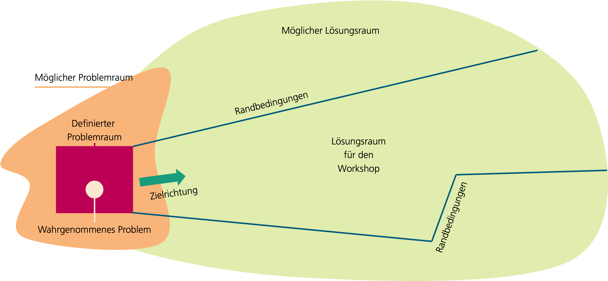

# Methode zur Visionserstellung

## Einführung zum Kapitel

Wir haben bereits gesehen, dass Datentreuhänder (DTH) in verschiedensten Domänen existieren und konnten anhand der Beispiele nachvollziehen, welche Probleme sie lösen und welche Anwendungsfälle sie unterstützen. Diesen Beispielen gemein ist, dass sie konkrete Visionen von DTH umsetzen. Was genau ist eine solche Vision, wie erreicht man sie und wie fügt man Details hinzu, bevor die eigentliche Umsetzung erfolgt?

DTH sind sozio-technische Systeme, die, wie andere IT-Systeme auch, mit Methoden des Software-Engineerings gestaltet und umgesetzt werden. Zu Beginn der hier vorgestellten »Methode zur Visionserstellung« steht die Frage »was« gestaltet werden soll. Die Vision muss geklärt, der gewünschte Zielzustand hinreichend konkret definiert werden. DTH sind ein Lösungsansatz, um bestimmte Probleme zu lösen. Nicht in jedem Fall eignen sie sich, um die »beste« Lösung zu erreichen. Teil der Methode zur Visionserstellung ist auch die Klärung, ob ein DTH-Konzept tatsächlich sinnvoll ist.

Was ist die Vision? Sie ist die Beschreibung eines positiven, potenziell möglichen, zukünftigen Zustands. Positiv heißt im Kontext von DTH, den nutzenstiftenden Einsatz eines DTH, um eines oder mehrere Probleme zu lösen, zu beschreiben. Eine Vision kann verschieden ausgedrückt werden: natürlichsprachlicher Text, Modelle, Zeichnungen, Simulationen, usw. Häufig kommen Kombinationen dieser Ausdrucksformen zum Einsatz.

Im Folgenden wird eine Methode vorgestellt, welche genutzt werden kann, um Vision eines DTH zu erstellen und mehrere solcher Visionen gegeneinander abzuwägen. Nicht immer sind alle Schritte dieser Methode nötig. Andere Methoden oder Schritte können ebenfalls erfolgreich angewendet werden, die hier vorgestellte Methode ist nicht exklusiv zu verstehen. Sie basiert auf den Aktivitäten im Forschungsprojekt »Kickstart-Trustee« sowie den Erfahrungen der Fraunhofer-IESE Expert*innen in anderen Forschungs- und Praxisprojekten.

### Schnellüberblick

Die Methode zur Visionserstellung basiert auf dem Konzept des »IESE VIEW« (Vision & Innovation Experience Workshop). VIEW ist eine expertenbasierte, kreative Workshopmethode, mit deren Hilfe konkrete Lösungsszenarien für Herausforderungen der digitalen Transformation erzeugt werden.

Abbildung 1 zeigt den Überblick über die Methode zur Visionserstellung, welche aus drei Phasen besteht: »Vorbereitung«, »Workshop« und »Nachbereitung«. Ziel der Phase »Vorbereitung« ist, sowohl die organisatorischen Rahmenbedingungen zu klären (welcher Zeitrahmen ist möglich, wo soll der Workshop stattfinden, wer ist verantwortlich, …) als auch das Problem sowie den potenziellen Lösungsraum zu definieren. In der Phase »Workshop« wird der eigentliche Workshop durchgeführt, welcher idealerweise mit 12-18 Teilnehmer*innen plus Moderator*innen stattfindet. Die Ergebnisse des Workshops werden in der Phase »Nachbereitung« dokumentiert, wichtige Annahmen hinsichtlich der Machbarkeit die im Workshop getroffen worden werden geprüft und eine Entscheidung »wie es weitergeht« wird getroffen.

Ist die Verfügbarkeit des Teams gegeben, kann die gesamte Methode innerhalb eines Zeitraums von ca. ein bis zwei Wochen durchgeführt werden. Realistisch sind aus Erfahrung aber Zeiträume von drei bis sechs Wochen für den Abschluss aller Phasen.

Abbildung  1: Überblick über die Methode zur Visionserstellung für DTH-Visionen.

### Aufbau dieses Kapitels

Die Beschreibung der Methode zur Visionserstellung ist in die drei Phasen »Vorbereitung«, »Workshop« und »Nachbereitung« eingeteilt. In jeder Phase werden wichtige Aufgaben und Entscheidungspunkte erläutert. In der Phase »Workshop« wird ein beispielhafter Ablaufplan präsentiert und anhand dessen werden die einzelnen Sessions des Workshops erläutert. Die »Nachbereitung« bildet den Abschluss der Arbeiten an der Visionserstellung.

In diesem Kapitel nutzen wir ein greifbares Beispiel, um die Durchführung der Methode zur Visionserstellung zu illustrieren. Dazu treffen wir folgende Annahmen: ein Unternehmen (Anbieter von Mobilitätsservices) definiert ein  **Projekt**  mit dem Ziel, eine Datentreuhänderlösung im Bereich Mobilitätsdaten zu konzipieren und umzusetzen. Hintergrund ist, dass Mobilitätsdienstleister mehr Daten brauchen, um effizientere und bessere Mobilitätsangebote anzubieten. Bewegungsprofile von Menschen (z. B. Pendler*innen) ermöglichen jedoch Rückschlüsse auf das Verhalten, Wohnort und Arbeitsorte von Datengebern. Außerdem könnten weitere Daten, wie Alter, Geschlecht, Einkommenssituation, von Interesse sein, welche personenbezogen und deshalb besonders schützenswert sind. Das Projekt wird von einem  **interdisziplinären**  **Projektteam aus Mitarbeiter*innen**  des Unternehmens bearbeitet. Das Projektteam folgt dem Framework für Datentreuhänder und wird die  **Methode zur Visionserstellung**  **anwenden,** um eine klare und konkrete Vorstellung (Vision) des gewünschten Datentreuhänders zu entwickeln.

## Phase I: Vorbereitung

Bevor die Vision des DTH-Ansatzes im Rahmen des Workshops ausgestaltet wird, muss dieser sorgfältig vorbereitet werden. Dieser Schritt »Vorbereitung« ist nicht optional und legt die Grundlage für eine erfolgreiche Visionsentwicklung. Typischerweise finden in dieser Phase mehrere Treffen der Projektbeteiligten (insbesondere des Kernteams) statt, um die nachfolgend beschriebenen Fragen zu klären. Es ist davon auszugehen, dass Iterationen und Schleifen bis zur vollständigen Beantwortung der hier beschriebenen Fragen stattfinden. Erst wenn diese ausreichend konkret beantwortet sind, kann die eigentliche Planung des Workshops und die Durchführung in Phase II folgen. Die Aktivitäten der Phase Vorbereitung sind in vier Themenkomplexe geteilt, welche aber untereinander starke Abhängigkeiten aufweisen.

Abbildung  2: Ablauf von Phase 1 (Vorbereitung) der Methode zur Visionserstellung.

### Projektrahmenbedingungen klären

In diesem Themenkomplex müssen alle wichtigen Rahmenbedingungen geklärt werden. Zunächst gilt es, die  **Ausgangssituation**  zu definieren. Dazu müssen unter anderem die folgenden Fragen, sofern noch nicht bereits bei der Projektdefinition geschehen, beantwortet werden:

-   Welche Personen sind Teil des Projektteams? Welche Person(en) sind verantwortlich für das Projekt? Wer ist betroffen? Wer kommt als Workshopteilnehmer*in in Frage (siehe auch: Stakeholderanalyse)?
-   Welche Vorarbeiten wurden bereits geleistet? Auf welche Erfahrungen und Erkenntnisse kann zurückgegriffen werden?
-   Müssen externe Expert*innen involviert werden oder stehen alle nötigen Kompetenzen bereits zur Verfügung?
-   Welches Budget steht für die Erstellung der Vision des DTH, des Lasten- und/oder Pflichtenhefts des DTH und für die Umsetzung des DTH zur Verfügung?
-   Welcher Zeitrahmen steht für die Konzepterstellung und für die Umsetzung zur Verfügung?

In unserem Beispiel umfasst das Projekt das Ziel, eine DTH-Lösung für eine bestimmte Domäne (Mobilität) beziehungsweise einen Problemkomplex, der eine oder mehrere verwandte Domänen (z. B. Mobilität und öffentliche Verwaltung, Gesundheit, Feuerwehr und Rettungsdienste, …) umfasst, zu erstellen.

Die Methode zur Visionserstellung baut also auf den Grundlagen des Kickstart-Trustee-Frameworks (z. B. Definition eines Datentreuhänders, Beispiele aus verschiedenen Domänen, …) auf und setzt deren Kenntnis und Verständnis voraus. Aus Sicht der kreativen Problemlösung wäre ein vollständig offener Ansatz, bei dem zu einem Problemraum nicht von vorneherein die Lösung »Datentreuhänder« vorgegeben ist, zwar zu begrüßen, das ist aus unserer Erfahrung aber nicht mit den typischen Prozessen in Unternehmen oder Forschungsprojekten in Einklang zu bringen. Vorteilhaft ist, dass wir uns mit der Methode der Visionserstellung konkret auf Lösungsansätze für ein DTH-Konzept konzentrieren können. Daher ist die Bedingung für das weitere Vorgehen, dass das Vorhaben »DTH« zumindest initial erfolgsversprechend erscheint und ein grundsätzliches »Management buy-in« existiert.

### Stakeholder-Analyse

Im Themenkomplex Stakeholder-Analyse gilt es, eine Stakeholder-Analyse durchzuführen, um sicherzustellen, dass alle wesentlichen Betroffenen identifiziert werden können. Sie baut unter anderem auf der Klärung der Projektrahmenbedingungen auf. An dieser Stelle verweisen wir auf bekannte Methoden, beispielsweise das »Onion-Modell« (siehe Abbildung  3) oder die »Stakeholder-Matrix«, um die Analyse durchzuführen. Ziel dieser Analyse ist es, sicherzustellen, dass relevante Betroffene identifiziert werden, die als Teilnehmende oder als Beratende zum Erfolg des Workshops beitragen können. Insbesondere Stakeholder mit großem Interesse und/oder großem Einfluss sollten im Workshop vertreten sein. Diese können sowohl Teil des Projektteams sein, Teil der projektdurchführenden Organisation oder auch Externe (z. B. wichtige Partner aus anderen Unternehmen, der Politik, Rechtsgelehrte, …). Werden wesentliche Stakeholder nicht berücksichtigt, sinkt die Aussagekraft der Workshop-Ergebnisse, da häufiger Annahmen getroffen werden müssen.

Abbildung  3: Exemplarische Stakeholderanalyse nach dem Onion-Modell für das DTH-Beispiel »Mobilitätsdaten«.

### Definition des Problemraums und der Workshop-Challenge

Bevor wir eine Vision eines DTH entwickeln, ist es essenziell das zu lösende Problem und den Problemraum klar zu definieren. Es mag schwerfällig klingen, sich zunächst auf das Problem und nicht die Lösung oder den erwarteten Zielzustand zu konzentrieren, ist aber aus Sicht der Kreativitätstechniken, die hinter der Methode zur Visionserstellung stehen, essenziell. Nur wenn klar definiert ist, welche Probleme tatsächlich relevant sind, können die Workshopteilnehmenden fokussiert arbeiten. Abbildung 4 zeigt eine schematische Darstellung der Zusammenhänge. Der »mögliche Problemraum« umfasst »alle« Herausforderungen, die grundsätzlich in der Domäne vorhanden sind. Das »wahrgenommene Problem« ist der Startpunkt des Teams und ist häufig von der eigenen Perspektive und Erfahrung geprägt. Durch die Definition des Problemraums wird der zu bearbeitende Bereich eingegrenzt, ohne ihn zu sehr einzuengen. Zielrichtung und Rahmenbedingungen geben dann den Lösungsraum für den Workshop vor.

Um den Problemraum einzugrenzen kann nach verschiedenen Aspekten abgegrenzt werden. Beispielsweise können Unternehmensprozesse aus Kundensicht betrachtet werden und nur bestimmte Ausschnitte der Customer- oder User-Journey betrachtet werden. Ebenso bieten Produktionsprozesse häufig passende Schnittpunkte. Im Rahmen der Konzeption von DTH können bestimmte Partner explizit ausgeklammert oder einbezogen werden, um den Problemraum zu definieren, Annahmen hinsichtlich rechtlicher Rahmenbedingungen vorgegeben oder bestimmte Arten von zu betrachtenden Daten gesetzt werden. Ziel dieses Schritts ist in jedem Fall, so genau wie möglich zu definieren, welche Probleme betrachtet werden sollen und welche nicht.

Das zu betrachtende Problem sollte dann an als Workshop-Challenge formuliert werden. Das ist eine prägnante Formulierung, die das Problem benennt und seine Relevanz klarmacht, Chancen aufzeigt und motiviert. Dazu kann auf sogenannte »Wie können wir…«-Fragen (WKW) zurückgegriffen werden (englisch: »How might we…«). In unserem Beispiel könnte die WKW-Frage lauten: »Wie können wir Mobilitätsdaten von Pendler*innen für Mobilitätsdienstleister zugänglich machen, damit sie bessere Mobilitätsangebote entwickeln können, ohne die schützenwerten Daten der Pendler*innen zu gefährden?«. Sie zeigt den Problemraum (Datensammlung ermöglichen, Datenschutz einhalten, Daten gewinnbringend nutzbar machen) und die Chancen (bessere Mobilitätsangebote) und motiviert so.

Abbildung 4: Schematische Darstellung des Kreativprozesses vom Problem- zum Lösungsraum. Bewusste Grenzen und Randbedingungen fokussieren den Workshop.

### Definition von Randbedingungen und des relevanten Lösungsraums

Im vierten Themenkomplex werden wichtige Randbedingungen und Einschränkungen des Lösungsraums der angestrebten DTH-Lösung definiert. Es geht  **explizit nicht**  darum, die Lösung bereits zu  **gestalten**  oder  **konzeptionelle Arbeiten**  durchzuführen. Randbedingungen beziehen sich in diesem Schritt auf wesentliche Parameter und Eckpunkte, die unbedingt beachtet werden müssen. Das umfasst beispielsweise den minimalen und maximalen Umfang der potenziellen Lösung (siehe auch »Budget« und »Zeitrahmen«), das Einbeziehen oder Ausklammern bestimmter Partner oder Konkurrenten, (Teil-)Prozesse die besonders beachtet oder explizit nicht beachtet werden sollen, bestimmte Nutzergruppen die besonders in den Fokus gerückt oder ausgeklammert werden sollen, usw. Alle Projektbeteiligte müssen klar vor Augen haben, »wohin die Reise in etwa gehen wird – und wohin nicht«. Dieses gemeinsame Verständnis ist wichtig, um den Workshop entsprechend zu gestalten und zielgerichtet durchführen zu können.

### Planung des Workshops

Abschließend muss in Phase I noch der eigentliche Workshop geplant und konkret vorbereitet werden. Spätestens jetzt muss festgelegt werden, wer den Workshop moderieren wird und ob eine Co-Moderator*in zur Unterstützung nötig ist. Moderator*in und Co-Moderator*in kümmern sich um die weitere Vorbereitung und leiten durch den Workshop, werden aber selbst nicht inhaltlich mitarbeiten sondern eine möglichst neutrale Rolle einnehmen. Die Teilnehmer*innen (15-18 Personen sind ideal) werden in Gruppen aus ca. fünf bis sieben Personen eingeteilt, wobei jede Gruppe möglichst alle verschiedenen Stakeholdergruppen, Rollen, Kompetenzen und Erfahrungslevel sowie Geschlechter beinhalten sollte. Nicht immer ist das zu schaffen, man sollte aber bereits bei der Auswahl der Teilnehmenden auf eine ausgewogene Zusammensetzung achten.

Organisatorische Themen (z. B. Terminvereinbarungen, Termineinladungen, Raumreservierungen, Catering/Verpflegung, …) müssen geklärt werden, um einen reibungslosen Ablauf des Workshops gewährleisten zu können.

Der Workshop sollte idealerweise als Präsenztermin an zwei aufeinanderfolgenden Tagen stattfinden. Ausnahmen hiervon sollten nur in absoluten Ausnahmefällen gemacht werden. Teilnehmer*innen müssen unbedingt sicherstellen, dass sie vollständig und ohne Unterbrechung am Workshop teilnehmen können, da die einzelnen Teile des Workshops inhaltlich aufeinander aufbauen. Das Wissen und die Erkenntnisse aus Diskussionen aus vorangegangen Teilen ist wichtig, wird häufig nicht explizit dokumentiert und liegt nur als geteiltes Wissen innerhalb der Gruppe vor.

Der Workshopraum sollte etwa 50-80 m2  groß sein, um Platz für eine Tischgruppe je Gruppe zu bieten. Für die Gruppenarbeiten werden je Gruppe drei Metaplanwände (mit Packpapier) und/oder drei magnetische Whiteboards benötigt. Flipchart-Ständer können zusätzlich eingesetzt werden, ersetzen aber nicht mehrere Metaplanwände oder Whiteboards, da die Zwischenergebnisse der einzelnen Phasen für alle Teilnehmer*innen des Workshops dauerhaft sichtbar sein sollen.

Abbildung 5: Beispielhafter Raumplan für einen DTH-Workshop. [1] Tischgruppe für ca. 6 Personen. [2] Metaplanwände oder magnetische Whiteboards. [3] Tisch für Moderation. [4] Großer Bildschirm oder Projektionsfläche. [5] Bereich für Catering (Getränke, Kaffee, Snacks) im Raum.

Im nachfolgenden Kapitel gehen wir detailliert auf den Workshopablauf ein und beschreiben die einzelnen Sessions des Workshops. Viele dieser Sessions nutzen Vorlagen, welche die Teilnehmer*innen während des Workshops nutzen. Für den Schritt »Planung des Workshops« ist wichtig, die Vorlagen entsprechend der Workshop-Challenge anzupassen und in ausreichender Menge auszudrucken. In den Abschnitten der jeweiligen Sessions wird im Folgenden erläutert, wie die Vorlagen und Anweisungen für die Teilnehmer*innen anzupassen sind, da diese Informationen im Kontext der jeweiligen Session verständlicher sind als in diesem Abschnitt. Es gilt aber zu beachten, dass die Anpassungen in der eigentlichen Vorbereitung des Workshops stattfinden müssen.

Zusätzlich zu den Vorlagen wird weiteres Material benötigt, das vor Beginn des Workshops bereits sortiert bereitgelegt werden sollte. Eine beispielhafte Materialliste ist nachfolgend dargestellt. Je nach räumlicher Situation wird nicht immer alles auf dieser Liste gebraucht, mit dieser Ausstattung sind die Moderator*innen aber gut vorbereitet.

-   Moderationskoffer (1 St.)
-   Flipchartpapier (3 Rollen)
-   Packpapier (20 Blatt)
-   Stift, dick, schwarz (1 je Teilnehmer*in plus Reserve)
-   Stift, dick, rot (1 je Teilnehmer*in plus Reserve)
-   Stift, dick, blau (1 je Teilnehmer*in plus Reserve)
-   Stift, medium, schwarz (1 je Teilnehmer*in plus Reserve)
-   Stift, fein, schwarz (1 je Teilnehmer*in plus Reserve)
-   Ggf. Whiteboard-Stifte
-   Moderationskarten, bunt, sortiert, eckig (je 100 St.)
-   Moderationskarten, bunt, sortiert, rund (je 100 St.)
-   Tesafilm (3 Rollen)
-   Klebestift (3 St.)
-   Schere (3 St.)
-   Pinnadeln (6 Dosen)
-   Heftklammern, groß (1 Pckg.)
-   Pattafix (9 Pckg.)

-   Alle Vorlagen, ausgedruckt, sortiert
-   Uhr / Timer-App

-   Fotokamera + Ladekabel
-   Namensschilder
-   Foliensätze
-   ausgedruckte Vorlagen

## Phase II: Workshop

Der Kern der Visionsentwicklung findet im Workshop statt, der in Phase I vorbereitet wurde. Im Folgenden werden die einzelnen Sessions (Teile) des Workshops beschrieben. Moderationsanweisungen helfen, die Sessions anzuleiten und Materialien, welche die Arbeit der Teilnehmer*innen unterstützen, werden erläutert.

Alle Phase I Schritte sind erledigt, der Raum ist vorbereitet, die Gruppen für die Workshoparbeit sind eingeteilt, Tische mit den Namensschildern Sitzplätze in den Gruppen markiert und die Teilnehmer*innen sind eingetroffen. Nun kann der Workshop zur Visionsentwicklung beginnen.

Die einzelnen Sessions, welche in Tabelle 1 überblicksartig dargestellt sind, werden von den Moderator*innen nacheinander angeleitet. Die Moderation stellt sicher, dass alle Teilnehmer*innen zum richtigen Zeitpunkt die richtigen Informationen haben, achtet auf die Zeit und steuert die Arbeit der Teilnehmer*innen in die gewünschte Zielrichtung – ohne selbst inhaltlich mitzuarbeiten. Es gilt die Motivation hochzuhalten, im richtigen Maß Druck und Kontrolle auszuüben und stets den Überblick zu bewahren. Die nachfolgenden Beschreibungen verstehen sich als Hilfestellung für Moderator*innen des Workshops zur Visionsentwicklung und sollten nicht mit den Teilnehmer*innen geteilt werden.

Tabelle  1: Ablaufplan des Workshops zur Visionsentwicklung.

| Dauer in Minuten | Session                     | Kurzbeschreibung                                                                                                               |
|------------------|-----------------------------|--------------------------------------------------------------------------------------------------------------------------------|
| 10               | Intro                       | Start in den Workshop, kurze Hinführung zum Thema,   Erläuterung der Challenge                                                 |
| 30               | Vorstellungsrunde           | Ausführliche Vorstellungsrunde zum Aktivieren und   Kennenlernen                                                               |
| 20               | Thematischer Einstieg       | Impulsvortrag zu Grundlagen von Datentreuhändern                                                                               |
| 30-40            | Problemsammlung             | Stichpunktartige Sammlung wichtiger Probleme innerhalb des   Problemraums                                                      |
| 60               | Problemdetails              | Detaillierte root-cause Analyse ausgewählter Probleme                                                                          |
| 40               | Ideensammlung I             | Zielgerichtete Sammlung einer großen Zahl von Ideen                                                                            |
| 45               | Priorisierung               | Auswahl vielversprechender Ideen                                                                                               |
| 90               | Erstes Lösungsszenario      | Konstruktion eines Lösungsszenarios für DTH im Kontext der   Workshop Challenge                                                |
| 10               | Verabschiedung              | Verabschiedung zum Ende des ersten Tages                                                                                       |
| 10               | Begrüßung, Wiederholung     | Start in den zweiten Tag und Wiederholung der Ergebnisse des   ersten Tags                                                     |
| 30               | Impulsvortrag               | Keynote-artiger Vortrag, kreativer Impuls                                                                                      |
| 45               | Positive & negative Aspekte | Sammlung einer großen Zahl von Ideen                                                                                           |
| 10               | Transformation              | Einführung neuer Constraints für den Lösungsraum                                                                               |
| 90               | Zweites Lösungsszenario     | Konstruktion eines neuen Lösungsszenarios für DTH im Kontext   der Workshop Challenge oder Veränderung des Szenarios von Tag 1 |
| 30               | Bewertung                   | Bewertung aller Ergebnisse des Workshops                                                                                       |
| 45               | Nächste Schritte            | Skizzieren einer Roadmap für die weiteren Schritte                                                                             |
| 20               | Outro                       | Abschlussdiskussion und Feedback, Verabschiedung                                                                               |

### Intro

Zu Beginn des Workshops sollten die Teilnehmer*innen willkommen geheißen, organisatorische Rahmenbedingungen geklärt und die »Spielregeln« erläutert werden. Typische Inhalte sind:

-   Die Lage der Toiletten
-   Die Pausenregelung: z. B. jederzeit an Snacks, Getränken und Kaffee bedienen, zwischendrin Kaffeepausen und eine gemeinsame Mittagspause
-   Keine Paralleltermine, Telefonate und E-Mails bitte nur in den Pausen

Außerdem sollte die für den Workshop definierte Challenge den Teilnehmer*innen kurz erläutert werden, um sie abzuholen. Die Moderation sollte an dieser Stelle versichern, dass es nicht schlimm ist, zum jetzigen Zeitpunkt noch Unklarheit hinsichtlich des genauen Inhalts des Workshops zu verspüren. Häufig wünschen sich die Teilnehmer*innen ein hohes Maß an Vorabinformation und Kontrolle. In diesem Workshopkonzept sollen sich die Teilnehmer*innen aber auf die jeweilig laufende Session fokussieren und »im Prozess aufgehen«. Ziel ist es einen »Flow-Zustand« zu erreichen, bei dem die jeweilige Aufgabe gut zur empfundenen Kompetenz passt. Außerdem überspringen Teilnehmer*innen gerne die Beschäftigung mit Problemen, um sofort über Lösungen zu sprechen, ein tiefes Problemverständnis ist aber wichtig für den Kreativprozess der stattfinden soll. Aus diesem Grund muss die Moderation bereits direkt zu Beginn des Workshops »die Zügel in der Hand halten« und durch klare Ansagen keine Zweifel an ihrer Führungsrolle innerhalb des Workshops aufkommen lassen. Das heißt auch, den Workshop zwar kurz thematisch einzuläuten, ohne aber an dieser Stelle Diskussionen oder ausschweifende Rückfragen zuzulassen.

### Vorstellungsrunde

Die Auswahl der Teilnehmer*innen des Workshops sollte – wie bereits beschrieben – so erfolgen, dass möglichst alle Stakeholder, Rollen, Kompetenzen und Erfahrungen abgedeckt werden. Typischerweise bedeutet das, dass Teilnehmer*innen aus unterschiedlichen Bereichen und teilweise verschiedenen Organisationen zusammenkommen. Eine Vorstellungsrunde ist daher dringend angeraten. Wir empfehlen, die Vorstellungsrunde zu nutzen, um nicht nur die Namen der Teilnehmenden kennenzulernen, sondern einen wirklichen Einblick in ihre Rolle und ihren Hintergrund zu bekommen und sie bereits auf das Workshop-Setting einzustimmen. An dieser Stelle kann auch geklärt werden, ob das »Workshop-Du« statt dem förmlichen »Sie« genutzt werden darf.

Eine Möglichkeit dazu ist es, die Teilnehmer*innen zu bitten aufzustehen und sich in einem großen Kreis aufzustellen. Zusätzlich wird für jeden Teilnehmenden plus die Moderation eine Bildkarte (z. B. eine Postkarte, ein Bild von einem Spielzeug-Set, ein Foto von einem Zootier, ein Foto einer olympischen Sportart, …) benötigt.

Die Moderation beginnt mit der Vorstellungsrunde, gefolgt von der Co-Moderation und eröffnet dann eine beliebige Reihenfolge für die Teilnehmer*innen. Alle beantworten die folgenden Fragen beziehungsweise nennen die gefragten Dinge:

-   »Nenne bitte deinen Namen und deine Rolle in deinem Unternehmen.«
-   »Erkläre, was du wirklich tust. Also nicht, was in deiner Job-Beschreibung steht, sondern das, was deinen Arbeitsalltag ausmacht.«
-   »Wie passt das zu dem, was du auf deiner Bildkarte siehst? Wo ziehst du parallelen zwischen dem, was abgebildet ist und dem, was du wirklich in deinem Job tust?«

Die Vorstellungsrunde über Bildkarten ist gut geeignet, um die Teilnehmenden zu Beginn des Workshops »aus der Reserve zu locken«. Es stellt bereits eine erste kleine Herausforderung dar, Assoziationen zwischen der Bildkarte und der untypischen Frage nach »der eigentlichen Arbeit« zu ziehen, ohne zu überfordern. Damit wird der Grundstein für den »Flow« im Workshop gelegt. Nach der Vorstellungsrunde dürfen sich die Teilnehmer*innen wieder auf ihren Platz setzen.

### Thematischer Einstieg

Das Konzept »Datentreuhänder« ist komplex und wichtige Begriffe und Eigenschaften müssen allen Teilnehmer*innen geläufig sein. Als gemeinsamer Startpunkt für weitere Überlegungen soll an dieser Stelle sichergestellt werden, dass alle über das gleiche Verständnis von »Datentreuhändern« verfügen. In einem Impulsvortrag stellt der Moderator oder die Moderatorin die wesentlichen Aspekte und Eigenschaften kurz und inspirierend vor. Dazu kann der Foliensatz XXX genutzt werden, der im Anhang beigefügt ist.

### Problemsammlung

Die Problemsammlung ist die erste »inhaltliche« Session des Workshops. Die Moderation greift nun noch einmal die Workshop-Challenge auf, um für alle zu wiederholen, um welchen Problemraum es nun geht. Ziel der »Problemsammlung« ist es, einen breiten Überblick über den Problemraum zu erlangen und die unterschiedlichen Aspekte und Perspektiven zu verdeutlichen, die ihn bestimmen. Es geht hierbei nicht um eine vollständige Analyse oder Exaktheit. Ziel der Problemsammlung ist es, den Blick der Workshop-Teilnehmer*innen auf den gesamten Problemraum zu weiten und für andere Perspektiven und Erfahrungen zu öffnen. Abbildung 6 zeigt beispielhaft das Ergebnis einer solchen Session.

Die Problemsammlung wird als Plenumsaufgabe von allen Teilnehmer*innen gleichzeitig und ohne Gruppeneinteilung durchgeführt. Dazu verteilt die Moderation Stapel eckiger Moderationskarten an alle Teilnehmer*innen sowie je einen dicken schwarzen Stift und bittet sie sich vor zwei freien Pinnwänden oder magnetischen Whiteboards aufzustellen. Dann sollen sie auf die Moderationskarten Probleme aufschreiben, die sie aus ihrer Erfahrung im Problemraum auftreten. Je nachdem wie der Problemraum geschnitten wurde, können »Bereiche« oder »Themen« zur Hilfestellung an die Pinnwand oder das Whiteboard geschrieben werden, um bereits grobe Cluster vorzugeben und eine Hilfestellung zu bieten.

In unserem Beispiel könnte die Frage nach Problemen folgendermaßen formuliert sein: »Welche Probleme machen es Mobilitätsdienstleistern schwer oder sogar unmöglich

Sobald eine Teilnehmer*in eine Karte beschrieben hat händigt sie sie der Moderation aus, welche die Karte dann sofort laut vorliest und an die Pinnwand oder das Whiteboard heftet. Falls unklar ist, was unter dem Problem zu verstehen ist, fragt die Moderation nach und ergänzt gegebenenfalls auf der Karte. Passt eine weitere Karte zu einer bereits angehefteten, dann platziert die Moderation die Karte in räumlicher Nähe zur ersten (spontantes Clustering).

Diese Session wird ohne sichtbares Zeitlimit durchgeführt und sollte exklusive der Erklärung etwa 25 bis 35 Minuten dauern. Es ist normal, dass zu Beginn eine große Zahl von Karten beschrieben wird und die Menge nach der Hälfte der Zeit nachlässt. An dieser Stelle sollte die Moderation gezielt Fragen stellen, um die weniger offensichtlichen Probleme aus den Teilnehmer*innen »herauszukitzeln«. Das führt dazu, dass im letzten Drittel der Bearbeitungszeit noch einmal einige neue Karten dazukommen.

Die Session endet, wenn keine neuen Karten mehr geschrieben werden. An dieser Stelle sollte die Moderation noch einmal zusammenfassen welche Cluster sich gebildet haben und auf einige vielversprechende Karten eingehen.

Abbildung 6: Beispielhaftes Ergebnis einer Problemsammlung. Hier wurde mit zwei verschiedenen Kartenarten gearbeitet, um eine Abstufung der Dringlichkeit der Probleme zu unterscheiden.

### Problemdetails

Nach der Sammlung vieler Probleme – um den Teilnehmer*innen zu ermöglichen, einen Überblick über den Problemraum zu erlangen und damit das »bigger picture« zu sehen – folgt die detaillierte Analyse der wichtigsten Probleme. Diese konvergierende Phase ist wichtig, da die überblicksartige Problemsammlung allein noch kein echtes Problemverständnis ermöglicht. Bevor an Ideen oder Lösungsszenarien (und damit der Ausgestaltung des DTH) gearbeitet wird, muss ein Verständnis »des eigentlichen Problems« erreicht werden.

Diese Session wird als Gruppenarbeit durchgeführt. Jede Gruppe bearbeitet in vorgegebener Zeit (z. B. 45 Minuten, per sichtbarem Timer durchgesetzt) nacheinander Problemkarten, indem diese aus der Sammlung entnommen werden, und analysiert die Hintergründe. Die Gruppen arbeiten also »first-come first-serve«. Nimmt eine Gruppe ein Problem aus der Sammlung, kann es nicht mehr von einer anderen Gruppe bearbeitet werden. Zur Analyse der Probleme kann die [Vorlage im Anhang](template_problemanalyse.pdf) als Arbeitshilfe verwendet werden. Nach Ablauf des Timers stellen die Gruppen ihre Ergebnisse jeweils im Plenum vor.

Diese Session ist im Gegensatz zur Problemsammlung konvergierend, also zusammenlaufend oder auch analytisch. Sie entspricht der Idee einer Root-Cause-Analyse, bei der die Hintergründe und die Ursachen eines Problems genau betrachtet werden sollen. Die Vorlage, welche einem Formular ähnelt, steuert die Gruppen in die Analyse der Hintergründe und Ursachen der Probleme. Damit das gelingt, müssen die Fragen auf der Vorlage zur jeweiligen Workshop-Challenge passend zugeschnitten werden. Dafür müssen bereits während der Vorbereitung des Workshops potenzielle Probleme aus der Session Problemsammlung antizipiert und diese dann vor dem Hintergrund der Rahmenbedingungen und des zu analysierenden Lösungsraum mit Hilfe der Fragen »in der Spur gehalten werden«. Am Beispiel des DTHs für die Mobilitätsdomäne könnten Frage auf dem Formular lauten: »Welche Entscheidungen und Prognosen können Mobilitätsanbieter heute nicht datenbasiert treffen, weil sie keinen Zugriff auf Mobilitätsdaten haben?« und »Welche Workarounds setzen Mobilitätsanbieter heute ein, um dennoch Entscheidungen treffen und Prognosen erstellen zu können?«. Diese Fragen zielen insbesondere auf die Probleme der Anbieter ab. Legt man stattdessen einen anderen Ausschnitt des Problemraums für diesen Workshop fest, dann könnten Fragen lauten: »Bei welchen Aktivitäten fallen bei Pendler*innen welche Mobilitätsdaten genau an, die von Interesse für Mobilitätsanbieter sind?« und »Was genau hält Pendler*innen heute davon ab, ihre Mobilitätsdaten mit Mobilitätsanbietern zu teilen?«.

### Ideensammlung I

Das Ziel dieser Session ist es, in kurzer Zeit eine große Anzahl von ersten Ideen zu entwickeln. Dazu empfehlen wir die Technik »6-5-3-Brainwriting«. Im Gegensatz zum klassischen Brainstorming arbeiten die Teilnehmer für sich selbst, lassen sich aber dennoch von den Ideen der anderen inspirieren, folgen dabei aber klaren Regeln, die leichter einzuhalten sind als beim klassischen Brainstorming. Dafür kann die [Vorlage im Anhang](template_problemanalyse.pdf) verwendet werden. Abbildung 7 zeigt, wie diese Methode ohne die Vorlage angewendet werden kann.

Brainwriting ist eine Technik zur Ideenfindung für Gruppen von sechs oder mehr Personen. Der Name »6-5-3« geht auf die Grundstruktur der Technik zurück: Sechs Personen arbeiten fünf Minuten lang daran, drei Ideen zu einem bestimmten Thema (die Überschrift auf ihrem Blatt) zu finden und sie auf ein Blatt Papier zu schreiben. Dann geben alle ihr Blatt mit den drei Ideen an die nächste Person weiter und die nächsten fünf Minuten beginnen um drei neue Ideen zu entwickeln, die noch nicht auf dem Blatt stehen. Nach sechs mal fünf Minuten hat die Gruppe 90 einzigartige Ideen entwickelt.

Idealerweise besteht jede Gruppe der Workshop-Teilnehmer*innen aus sechs Personen. Ist das nicht der Fall, dann bildet die Moderation neue Gruppen, aus möglichst gleich vielen Personen, wobei jede Gruppe mindestens sechs und maximal acht Personen umfassen sollte. Hat eine Gruppe weniger Personen als eine andere, arbeitet sie dennoch mit der gleichen Anzahl an Blättern wie die andere(n) Gruppen, in jeder Runde wird ein Blatt jedoch nicht bearbeitet.

Eine Variante des 6-5-3-Brainwriting nutzt Reizworte je Blatt, um die Teilnehmer*innen einerseits zu lenken (Randbedingungen, Einschränkungen des Lösungsraums) und andererseits als Hilfestellung für Ideen zu dienen. Oftmals fällt es Teilnehmer*innen schwer »aus dem Nichts« auf Ideen zu kommen. Die Themen helfen ihnen, in bestimmten Bahnen zu denken, ohne sie zu sehr einzuschränken. Sie werden als Überschrift auf die Blätter geschrieben. Dazu eignen sich vor allem positiv besetzte Trendthemen. Die Überschriften sollten kurz und prägnant sein, um so eine »Denkrichtung« vorzugeben, ohne einzuschränken. Das hilft, die Kreativität der Teilnehmer*innen zu unterstützen und gleichzeitig steuernd die Lösungsrichtung auf den festgelegten Lösungsraum zu fokussieren. Die Moderation sollte alle Überschriften bei der Erläuterung der Aufgabenstellung kurz erklären, um sicherzustellen, dass alle Teilenehmer*innen das gleiche Verständnis haben.

Lassen Sie die Teilnehmer*innen während der fünf Minuten jeder Runde für sich arbeiten, aber geben Sie ihnen bei der 4-Minuten-Marke einen Hinweis, wie viel Zeit noch bleibt. Wenn Sie die Blätter an die nächste Person weitergeben, wiederholen Sie immer die Anweisung und sagen Sie den Teilenehmer*innen, in welche Zeile sie schreiben sollen. Achten Sie darauf, dass die Teilnehmer die Blätter nicht vor Ablauf der Zeit an die nächste Person weitergeben. Alle Teilenehmer*innen sollten sich die Zeit nehmen, um drei Ideen zu finden, die ihnen gefallen (und nicht unbedingt die erstbesten) und die zu der Überschrift auf ihrem Blatt passen.

Abbildung 7: Beispielhafte Umsetzung der 6-5-3-Brainwriting Methode mit Flipcharts als Blätter.

### Priorisierung

Im vorangegangenen Schritt haben die Teilnehmer*innen sehr viele Ideen erarbeitet (z. B. 324 Ideen bei 18 Workshop-Teilnehmer*innen). Bevor sie diese für die Erstellung eines Lösungsszenarios nutzen, sollten die Ideen priorisiert werden, um einen Überblick über die erstellten Ideen zu bekommen und die Erstellung des Lösungsszenarios zu vereinfachen.

Diese Session findet wieder als Gruppenarbeit statt, wobei dieselben Gruppen wie in der Session »Ideensammlung I« verwendet werden (falls diese von der üblichen Gruppeneinteilung abweicht). Jede Gruppe priorisiert in vorgegebener Zeit (z. B. 40 Minuten, per sichtbarem Timer durchgesetzt) alle Ideen auf ihren Brainwriting-Blättern. Wurde die Brainwriting-Vorlage aus dem Anhang verwendet, benötigen die Gruppen Scheren, um die Blätter in einzelne Ideen zu zerschneiden. Dann sortieren die Teilnehmer*innen die Ideen in die in Tabelle 2 dargestellte Matrix. Diese kann beispielsweise an einem Whiteboard gezeichnet oder auf einem Packpapier für Pinnwände vorbereitet werden.

Die Teilnehmer*innen sollten während der Session immer wieder an die verbleidende Zeit erinnert werden. Für eine ausführliche Analyse jeder einzelnen Idee ist nicht ausreichend Zeit – das ist im Design der Aufgabenstellung so vorgesehen. Es sollen schnelle »Bauchentscheidungen« getroffen werden. Der »Flow« muss auf dem schnellen Fortkommen liegen, um die Teilnehmer*innen nicht auszubremsen.

Tabelle  2: Priorisierungsmatrix für Ideen.

|                   | Geringe Kosten                                                                              | Hohe   Kosten                                                                            |
|-------------------|---------------------------------------------------------------------------------------------|------------------------------------------------------------------------------------------|
| Kleine Auswirkung | »Nebentätigkeiten«      Kann man sie durch Transformation in einen anderen Bereich bringen? | »Undankbare   Aufgaben«      Die Finger von diesen Ideen lassen.                         |
| Große Auswirkung  | »Quick   Wins«      Sofort umsetzen, wichtige Ideen.                                        | »Große   Projekte«      Vielsprechende Visionen. Ideen, die einen Vorsprung ermöglichen. |

### Erstes Lösungsszenario

Nachdem sowohl ein Verständnis für den relevanten Problemraum aufgebaut, Detailanalysen zu besonders relevanten Problemen durchgeführt und eine große Zahl an Ideen gesammelt und priorisiert wurde gilt es nun, diese zu einer ersten Version der Vision zu entwickeln. Wie eingangs beschreiben lässt sich eine Vision sehr unterschiedlich darstellen. Je nach Problemstellung, Randbedingungen und Lösungsraum sollte die Darstellungsform angepasst werden. Einige Archetypen sind: »Day in a Life«, »Storyboard«, »Systemlandkarte« und »Service Blueprint«.

Ein »Day in a Life«-Szenario beschreibt die positive Zukunftsvision anhand eines typischen Tagesablaufs einer relevanten Persona (Repräsentant einer Gruppe, beispielsweise der Pendler*innen) und zeigt an wichtigen Stellen in diesem Tagesablauf, warum die Zukunft besser ist als der Status-Quo (in dem für die Persona wichtige Probleme gelöst und Mehrwerte geschaffen werden). Das »Storyboard« ist ähnlich, fokussiert aber einen Ausschnitt der Geschichte bzw. relevante Abschnitte und kann so auch mehr als einen Tag umfassen. Häufig wird dabei auch gefordert, dass die einzelnen Szenen des Storyboards gezeichnet werden müssen. Die »Systemlandkarte« legt den Fokus der Zukunftsvision stärker auf das »wie« statt das »was«, indem skizzenhaft gezeigt wird, wie welche Systeme zusammenspielen müssen, um einen positiven Zustand zu erreichen. Es muss unbedingt darauf geachtet werden auch einfach und klar zu beschreiben, was dieser positive Zustand ist, sonst verfehlt die Vision ihre positive Wirkung. Ein Mittelweg zwischen Szenario und Systemlandkarte ist der »Service Blueprint«, bei dem ein Ablauf aus Sicht der Nutzer*innen beschrieben wird (Fokus auf den Nutzen und das Erleben der positiven Zukunft), zusätzlich aber auch Systemreaktionen und Systemhintergrundaktionen modelliert werden die nötig sind, um den Ablauf zu ermöglichen.

Jeder dieser Archetypen kann sich – je nach Workshop-Challenge – eignen, um die Vision zu beschreiben. In jedem Fall müssen die Moderator*innen zu Beginn der Session genau beschreiben, was die Teilnehmer*innen tun sollen. Die Session wird als Gruppenarbeit durchgeführt und die Erstellung des Szenarios dauert ca. 45-60 Minuten (je nach Typ). Anschließend präsentieren die Gruppen ihre Ergebnisse vor den anderen Gruppen. Bestimmte Randbedingungen (z. B. Muss-Partner, Zeithorizont für die Umsetzung, …) werden als Szenario-Randbedingungen an die Gruppen weitergegeben. Das kann beispielsweise in Form einer Checkliste geschehen oder die Moderator*innen weisen die Teilnehmer*innen immer wieder darauf hin.

Die Ergebnisse dieser Session sind – verglichen mit den Sessions zuvor – stark unterschiedlich je nach Teilnehmer*innen und Workshop-Challenge. Die Moderator*innen haben mit der Workshop-Planung bis hierhin die Grundlage gelegt, damit die Zukunftsszenarios (und damit die ersten Versionen der Vision) auf realen Problemen basieren, die wichtigsten Hürden adressieren und auf kreative Art echte Mehrwerte schaffen. In dieser Session müssen die Moderator*innen stärker als zuvor überwachen und ggf. nachsteuern um eine hohe Qualität und die Einhaltung der Randbedingungen sicherzustellen.

### Positive & negative Aspekte

Jede Gruppe hat nun ein Lösungsszenario, basierend auf der großen Zahl von Ideen aus dem Brainwriting, erarbeitet, also eine Zukunftsvision eines Datentreuhänders für eine bestimmte Problemkonstellation. Im der nun folgenden Session bewerten die Gruppen jeweils das Szenario einer anderen Gruppe, identifizieren sowohl positive als auch negative Aspekte und schreiben diese auf Moderationskarten. Die Karten werden dann so genau wie möglich an die Stellen im Szenario, die sie betreffen, gelegt oder gepinnt. Dazu erhalten die Teilnehmer*innen ca. 20 Minuten Zeit. Nach Ablauf der Zeit gehen die Gruppen zurück zu ihrem eigenen Szenario und erhalten noch einmal ca. 20 Minuten Zeit, um über das Feedback zu diskutieren und daraus neue Ideen abzuleiten.

### Transformation und zweites Lösungsszenario

In dieser Session erstellen die Gruppen – ausgehend vom Feedback der vorangegangenen Session – ein weiteres Zukunftsszenario. Die Aufgabenstellung erfolgt analog zum ersten Lösungsszenario. Allerdings werden in dieser Session weitere Randbedingungen zur Transformation des Szenarios eingeführt. Die Moderation hat große Freiheiten, diese Session zu gestalten und die Randbedingungen einzuführen. Es gilt darauf zu achten, dass die vormals »breiten« Lösungsszenarien nun innerhalb die – in der Vorbereitung identifizierten – Leitplanken um den zugelassenen Lösungsraum herum eingefügt werden. Randbedingungen der Transformation können sein:

-   Ein neuer Zeithorizont der Betrachtung (z. B. Szenario muss die Zukunft in 2 Jahren abbilden).
-   Stakeholder benennen, die auf jeden Fall oder keinesfalls Teil des Systems sein müssen, beziehungsweise sein dürfen.
-   Bestimmte Aspekte von Geschäfts- oder Einnahmemodellen vorgeben, die unbedingt beachtet werden müssen.

In jedem Fall sollten die Auswirkungen der Transformation groß sein, sodass eine signifikante Überarbeitung des Szenarios nötig ist. Dadurch wird das Lösungsszenario noch einmal in einem kreativen Prozess geschärft, Feedback eingearbeitet und Randbedingungen des Lösungsraums genauer beachtet. Sind die Auswirkungen zu gering und damit die Herausforderung nicht hoch genug, neigen Teilnehmer*innen in dieser Session dazu, gedanklich bereits abzuschalten.

### Bewertung

Als letzte inhaltliche Session des Workshops kommt  eine konvergierende Technik zur Identifikation von besonders relevanten Ergebnisbestandteilen zum Einsatz. Sie eignet sich für kleine bis große Gruppen. Die Teilnehmer*innen müssen sich spielerisch für einen Bestandteil des gesamten Workshops entscheiden, den sie am wichtigsten einschätzen.

Der Moderator bzw. die Moderatorin fasst den Workshop zusammen, indem die einzelnen Techniken und ihre Ergebnisse ins Gedächtnis gerufen werden. Dabei sollte der Raum genutzt und die physischen Ergebnisse hervorgehoben werden. Das heißt beispielsweise, dass die Moderation zu den verschiedenen Tischgruppen läuft und an jedem Tisch die Ergebnisse einer Szenario-Technik zusammenfasst, während sie tatsächlich auf die einzelnen Elemente eines Szenarios am Whiteboard zeigt.

Dann führt die Moderation die eigentliche Aufgabe ein. Jede Teilnehmer*in erhält ein Bewertungstoken (z. B. ein Sticker, ein Aufkleber, …), welches symbolisch für den Wert »100.000 €« steht, die er oder sie in einem einzelnen Aspekt bzw. Ergebnisteil des Workshops  zuordnen soll, um anzuzeigen, dass aus Sicht der Teilnehmer*in dieser Aspekt bzw. dieser Teil weiterverfolgt werden sollte.

Die Teilnehmer*innen erhalten dann Zeit (je nach Komplexität der Ergebnisse zwischen fünf und zehn Minuten) ihre persönliche Wahl zu treffen und das ihnen zur  Verfügung stehende Geld auf einen Aspekt beziehungsweise ein Teilergebnis zu setzen. Dabei sollen sie ihr Geld so genau wie möglich vergeben. das heißt, nicht auf ein ganzes Szenario setzen sondern genau den wichtigsten Aspekt identifizieren, der aus ihrer Sicht dazu führt, dass sie das Szenario positiv bewerten möchten. Sie dürfen ebenfalls auf, aus ihrer Sicht, unterrepräsentierte oder im Workshop ungelöste, Probleme oder einzelne Ideen setzen. Das Geld (Token) wird dann so exakt wie möglich den Einzelaspekten zugeordnet und dort »angebracht« (mit Magneten, Pin-Nadeln, Pattafix, hingelegt, ...). Im Anschluss führt die Moderation durch ein schnelles Blitzlicht, bei dem jede Teilnehmer*in kurz erläutert, auf welchen Aspekt das Geld gesetzt wurde und warum.

### Nächste Schritte

Als Ausklang aus dem Workshop bietet sich eine Feedbackrunde mit Besprechung der nächsten Schritte an. So wird der Fokus der Teilnehmer*innen zum Schluss noch einmal stark »nach vorne« gerichtet. Zunächst sollten die Moderator*innen den Workshop von einmal zusammenfassen und Revue passieren lassen. Anschließen äußern die Teilnehmer*innen Feedback und ihre Gedanken, wie nun fortgefahren werden sollte, was die wichtigsten zu prüfenden Annahmen sind oder welche Teile der Szenarien (und damit der Vision des DTH) noch am stärksten nachgeschärft werden müssen. Das kann beispielsweise in Form eines Blitzlichts geschehen, bei dem jeder Teilnehmende genau zwei Minuten Zeit bekommt, auf die genannten Punkte einzugehen. Ganz zum Schluss sollte die Moderation, egal wie das Feedback ausgefallen ist, für einen positiven Ausblick und wohlmeinenden Abschluss sorgen.

## Phase III: Nachbereitung

Bereits während des Workshops wird die Grundlage für die Nachbereitung gelegt. Die Moderation muss von allen (Zwischen-) Ergebnissen ausreichend scharfe und gut lesbare Fotos anfertigen. Dazu wiederum müssen die Teilnehmer*innen immer wieder angehalten werden, so viel wie möglich aufzuschreiben – und zwar lesbar. Alle Fotos sollten den Teilnehmer*innen nach dem Workshop in Aufnahmereihenfolge zur Verfügung gestellt werden und dienen so als Gedankenstütze.

Es empfiehlt sich über die Fotos hinaus auch Videos anzufertigen. Gruppenarbeiten (z. B. Problemdetails, Lösungsszenario, …) sehen vor, dass die Ergebnisse im Plenum präsentiert werden. An dieser Stelle im Workshop können auch Videoaufnahmen der Präsentationen angefertigt werden. Häufig nennen und erklären Teilnehmer*innen während der Präsentation mehr über ihre Motivation und Beweggründe zur Ausgestaltung eines Ergebnisses als tatsächlich aufgeschrieben wurde. Durch die Videoaufnahme werden diese Informationen ebenfalls dokumentiert.

Es gilt nun zu prüfen, ob die erarbeiteten Lösungsszenarien tatsächlich vielversprechend genug sind, um mit ihnen fortzufahren, oder ob eine weitere Iteration nötig ist. Nur wenn tatsächliche Probleme einer oder mehrerer direkter Stakeholdergruppen »getroffen« wurden, ergeben sich Lösungsszenarien deren Umsetzung wertvoll erscheint. Ist das nicht der Fall, sollte zunächst mehr über die Herausforderungen der Domäne und der direkten Stakeholder herausgefunden werden, bevor in einen weiteren Workshop gestartet wird.

Erscheint das Lösungsszenario positiv, muss es noch gegen die Definition von DTH geprüft werden. Nicht immer werden die Workshopteilnehmer*innen eindeutige DTH-Lösungen entwerfen, da der Workshop darauf abzielt tatsächliche Probleme zu lösen, nicht »mit der Brechstange« ein bestimmtes Konzept (hier: DTH) zu forcieren. Das ist keine Schwäche der Methode, sondern eine Stärke. Ist das Lösungsszenario ein DTH, dann kann das Framework weiter unterstützen.

Wurden im Workshop, insbesondere in der Lösungsentwicklung, Annahmen getroffen oder lässt sich in der Analyse der Szenarien erkennen, dass bestimmten Aspekten große Unsicherheit anhaftet, müssen diese Annahmen und Unsicherheiten hinreichend geklärt werden, bevor mit der Bearbeitung des DTH im Framework fortgefahren wird. Das kann durch z. B. durch Recherche, Interviews, Gespräche oder Konsultationen von Rechtsgelehrten erfolgen.

Sind alle Annahmen und Unsicherheiten ausreichend geklärt und das Szenario des DTH verspricht Potenzial? Dann kann mit dem nächsten Schritt des Frameworks, »Tangible Trustee Design« fortgefahren werden.
