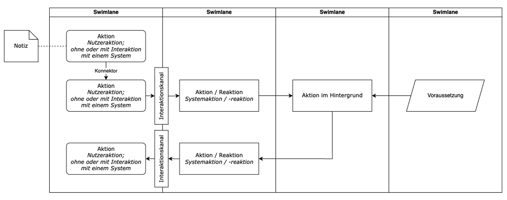

# Tangible Trustee Design
Im vorangegangenen Schritt des Frameworks wurden ein oder mehrere Lösungsszenarien, welche das generelle Nutzenversprechen eines Datentreuhänders (DTH) modellieren, erarbeitet, wichtige Annahmen überprüft und die Entscheidung zum Fortfahren getroffen.

Der Schritt »Tangible Trustee Design« (TTD) bildet die Brücke zwischen der generellen Vision (dem Lösungsszenario) und der konkreten Betrachtung von Anforderungen im Rahmen des Software Engineerings. Wir befinden uns also noch in der Definition des Scopes und der Konkretisierung der DTH-Lösung.

Ein  DTH ist ein sozio-technisches System. Dies bedeutet, dass ein solches nicht nur digitale technische Systeme umfasst, sondern explizit Organisationen und Menschen sowie deren Beziehungen untereinander einschließt.  Bei der Ausgestaltung der Vision müssen also diese Aspekte berücksichtigt werden. Tatsächlich liegt der Fokus der Arbeiten innerhalb der »Tangible Trustee Design« Methode vor allem auf den nicht-technischen Aspekten der Modellierung des DTH.

## Schnellüberblick

Die TTD-Methode folgt ähnlichen Prinzipien wie die »Methode zur Visionserstellung« indem sie stark auf workshopartige Formate setzt. Stärker noch steht hier aber der iterative Charakter der Arbeiten im Vordergrund. Ein TTD-Zyklus besteht aus mehreren Modellierungsschritten bzw. -Methoden und bis zur ausreichenden Konkretisierung des DTH müssen mehrere dieser Zyklen durchlaufen werden.

Innerhalb eines Zyklus wird zunächst das Kern-Nutzenversprechen des DTH als Service, also die Nutzungserfahrung, modelliert. Der Input dieser Aufgabe ist die Vision, welche im Vorangegangenen Schritt des Frameworks erstellt wurde.

## Aufbau dieses Kapitels

Die Beschreibung der TTD-Methode ist in die drei Phasen »Vorbereitung«, »Workshop« und »Nachbereitung« eingeteilt. In jeder Phase werden wichtige Aufgaben erläutert. In der Phase »Workshop« wird ein beispielhafter Ablaufplan präsentiert und anhand dessen werden die einzelnen Schritte der Methode erläutert. Die »Nachbereitung« bildet den Abschluss der Arbeiten an der Visionserstellung.

# Phase I: Vorbereitung

Die wichtigste Voraussetzung für die TTD-Methode ist eine konkrete Zukunftsvision. Folgt man den Schritten des Frameworks ist diese Voraussetzung durch die »Methode zur Visionserstellung« erfüllt.

In Phase I muss der Workshop geplant und konkret vorbereitet werden. Spätestens jetzt muss festgelegt werden, wer den Workshop moderieren wird und ob eine Co-Moderator*in zur Unterstützung nötig ist. Moderator*in und Co-Moderator*in kümmern sich um die weitere Vorbereitung und leiten durch den Workshop, werden aber selbst nicht inhaltlich mitarbeiten sondern eine möglichst neutrale Rolle einnehmen. Die Teilnehmer*innen (5-15 Personen sind ideal) werden in Gruppen aus ca. fünf bis sieben Personen eingeteilt, wobei jede Gruppe möglichst alle verschiedenen Stakeholdergruppen, Rollen, Kompetenzen und Erfahrungslevel sowie Geschlechter beinhalten sollte. Nicht immer ist das zu schaffen, man sollte aber bereits bei der Auswahl der Teilnehmenden auf eine ausgewogene Zusammensetzung achten.

Organisatorische Themen (z. B. Terminvereinbarungen, Termineinladungen, ggf. Raumreservierungen, ggf. Catering/Verpflegung, …) müssen geklärt werden, um einen reibungslosen Ablauf des Workshops gewährleisten zu können.

Der Workshop kann als Präsenztermin an zwei aufeinanderfolgenden Tagen stattfinden, er kann aber auch virtuell durchgeführt werden (dazu ist dann ein digitales Whiteboard zur gemeinsamen, zeitsynchronen Zusammenarbeit nötig). Teilnehmer*innen müssen unbedingt sicherstellen, dass sie vollständig und ohne Unterbrechung am Workshop teilnehmen können, da die einzelnen Teile des Workshops inhaltlich aufeinander aufbauen. Das Wissen und die Erkenntnisse aus Diskussionen aus vorangegangen Teilen ist wichtig, wird häufig nicht explizit dokumentiert und liegt nur als geteiltes Wissen innerhalb der Gruppe vor.

Bei einer Präsenzdurchführung sollte der Workshopraum etwa 50-80 m2  groß sein, um Platz für eine Tischgruppe je Gruppe zu bieten. Für die Gruppenarbeiten werden je Gruppe drei Metaplanwände (mit Packpapier) und/oder drei magnetische Whiteboards benötigt. Flipchart-Ständer können zusätzlich eingesetzt werden, ersetzen aber nicht mehrere Metaplanwände oder Whiteboards, da die Zwischenergebnisse der einzelnen Phasen für alle Teilnehmer*innen des Workshops dauerhaft sichtbar sein sollen.

# Phase II: Workshop

Die Ausgestaltung des DTH-Konzepts wird hier am Beispiel eines Workshopdurchlaufs beschrieben. Grundsätzlich muss dieser Schritt des Frameworks nicht unbedingt als ein Workshop durchgeführt werden, es können auch mehrere Termine angesetzt werden, ein einzelner Termin sollte aber mehrere Stunden umfassen, um deutliche Fortschritte zu erzielen.

Im Folgenden werden die einzelnen Sessions (Teile) des Workshops beschrieben. Moderationsanweisungen helfen, die Sessions anzuleiten und Materialien, welche die Arbeit der Teilnehmer*innen unterstützen, werden erläutert. Die einzelnen Sessions, welche in Tabelle 1 überblicksartig dargestellt sind, werden von den Moderator*innen nacheinander angeleitet. Die Moderation stellt sicher, dass alle Teilnehmer*innen zum richtigen Zeitpunkt die richtigen Informationen haben, achtet auf die Zeit und steuert die Arbeit der Teilnehmer*innen in die gewünschte Zielrichtung – ohne selbst inhaltlich mitzuarbeiten. Es gilt die Motivation hochzuhalten, im richtigen Maß Druck und Kontrolle auszuüben und stets den Überblick zu bewahren. Die nachfolgenden Beschreibungen verstehen sich als Hilfestellung für Moderator*innen des Workshops zur Visionsentwicklung und sollten nicht mit den Teilnehmer*innen geteilt werden.

_Tabelle 1: Beispielhafter Ablauf eines TTD-Workshops._

| Dauer in Minuten | Session          | Kurzbeschreibung                                                                                                                                                                                                                                                                                                                                                                                                 |
|------------------|------------------|------------------------------------------------------------------------------------------------------------------------------------------------------------------------------------------------------------------------------------------------------------------------------------------------------------------------------------------------------------------------------------------------------------------|
| 120              | DTH-Blueprint I  | Das Ziel der Modellierung   des DTH-Blueprints Ibesteht darin, die Aktivitäten und   Interaktionen der am Ökosystem-Service beteilig- ten Nutzer und Systeme   konkret abzubilden.                                                                                                                                                                                                                               |
| 90               | DTH-Blueprint II | Das Ziel der Modellierung   des DTH-Blueprints IIbesteht darin,   die Hintergrund-System-Aktivitäten und Voraussetzungen, vor   allem organisatorische, die für das Funktionieren der Abläufe erfüllt sein   müssen, konkret abzubilden.                                                                                                                                                                         |
| 180              | DTH-Map          | Das Ziel der Modellierung der DTH Map besteht   darin, die Rollen der Akteure im Ökosystem-Service zu bestimmen, den   Austausch zwischen ihnen auszuarbeiten und ein mögliches Ertragsmodell für   den Ökosystem-Service zu definieren. Dabei sind verschiedene Arten des   Austauschs zwischen den Akteuren zu berücksichtigen, insbesondere die Assets   und Gegenwerte in Form von Geld oder anderem Nutzen. |
| 120              | DTH-Motivation   | Das Ziel der Erstellung der DTH-Motivation ist es,   Vorteile und Mehrwerte der einzelnen Teilnehmer des DTH-Systems zu   identifizieren. Dabei wird jeweils gegenübergestellt, was ein Teilnehmer   durch seine Teilnahme erwartet und was er tatsächlich durch   den DTH bzw. die anderen Teilnehmer erhält.                                                                                                   |

## DTH Blueprint

Ein  DTH  Blueprint ist  angelehnt an Service Blueprints (auch Experience Blueprints), Hilfsmittel, um Dienstleistungsprozesse zu visualisieren, zu analysieren und zu optimieren.  Der DTH vereint die Sicht von allen wesentlichen Akteuren (Datengeber, Datennutzer, DTH) bei der digitalen Vermittlung von schützenswerten Daten mit organisatorisch-rechtlichen Voraussetzungen. Der Verlauf wird in einem Ablaufdiagramm dargestellt, das Swimlanes zur Einteilung der Informationen nutzt. Die möglichen Elemente sind in Abbildung 1 dargestellt. Folgende Swimlanes sind definiert:

-   Handlungen der Akteure Datengeber und Datennutzer: Aktionen, welche von den  Beteiligten durchgeführt werden.
-   Interaktionskanal / Tools: Interaktionskanal, mit dem die Nutzer interagieren, z. B. eine App oder eine Webseite.
-   Interaktionen: Aktionen, die ein Nutzer mit einem System durchführt.
-   System-Aktivitäten im Hintergrund: Aktivitäten eines Systems, z. B. Berechnungen, die von den Nutzern nicht unmittelbar gesehen werden.
-   Voraussetzungen (nicht-IT): Beispielsweise vertragliche und organisatorische Aspekte, die geregelt sein müssen, bevor die Vermittlung geleistet werden kann.

Abbildung  1: Legende der Elemente des DTH-Blueprints.

Der erste Schritt beim Erstellen des DTH-Blueprints ist, die Handlungen der Akteure Datengeber und Datennutzer zu identifizieren. Es mag spontan nicht intuitiv erscheinen, ein technisch-rechtliches System wie einen Datentreuhänder aus Nutzersicht zu modellieren. Der initiale Fokus auf Nutzer*innen sorgt aber dafür, dass der Nutzen (der Mehrwert für alle Beteiligten) des DTH nicht aus den Augen verloren wird. Ein DTH sollte nicht nur technisch und rechtlich »sauber« funktionieren, sondern nutzenstiftend sein.

Die Workshop Teilnehmer*innen modellieren die Nutzeraktivitäten der Vision möglichst vollständig und bilden den gesamten Service ab. Dabei sollen sowohl Aktionen der Datengeber als auch der Datennutzer modelliert werden. Aktionsbeschreibungen sollen möglichst im Aktiv erfolgen (»wer tut was«) und ausdrücklich auch relevante Ausschnitte aus dem Nutzungskontext beinhalten, die nicht direkt mit dem DTH zusammenhängen. Am Beispiel des DTHs in der Mobilitätsdomäne könnte das Aktivitäten von Pendler*innen beinhalten, bei denen indirekt Daten anfallen oder die zeigen, wie sie (später) von ihrer Datenfreigabe profitieren.

Anschließend werden die Systemaktionen und -reaktionen von den Teilnehmer*innen modelliert. Das Systemverhalten oder die Systemreaktion auf die menschliche Aktion  muss konkret dargestellt werden.Konnektoren werden genutzt, um die Elemente logisch miteinander zu verbinden. Ergänzt werden sie um die Systemaktionen im Hintergrund und Voraussetzungen, die geschaffen sein müssen, damit der Service funktionieren kann.

Je genauer und ausführlicher der Service modelliert wird, desto klarer ist das Zukunftsbild des DTH, der umgesetzt werden soll und Probleme können frühzeitig erkannt werden. Es können auch mehrere solcher Blueprints erstellt werden, wenn stark unterschiedliche Services gemeinsam das Gesamtbild des DTH ergeben.

## DTH-Map

Der zweite Schritt des TTD ist die Erstellung der DTH-Map. Hierbei geht es darum, die verschiedenen Akteure rund um den DTH und ihre Interaktionen zu modellieren. Es geht hierbei nicht um einen zeitlichen Ablauf sondern um die logischen Flüsse von »schützenswerten Daten«, »unterstützenden Daten«, »Geld« und um »Vertragsbeziehungen«.

Dazu werden zunächst die wesentlichen beteiligten Organisationen oder Stakeholdergruppen aus dem DTH-Blueprint extrahiert (Datengebende Organisationen und Personen, Datennutzende Organisationen, DTH-Betreiber, Geldgeber, ggf. Datenveredler, etc.) und auf Karten geschrieben. Diese werden dann auf einem großen Blatt Papier oder an einem Whiteboard organisiert, so dass der DTH-Betreiber in der Mitte steht, Datengebende Organisationen oder Stakeholder links davon stehen und Datennutzende Organisationen rechts davon stehen. Unterstützende Organisationen wie Geldgeber und Datenveredler werden oberhalb und unterhalb des DTH-Betreibers platziert.

Mit Hilfe von gerichteten Verbindungen (Pfeile) werden nun zunächst die Flüsse von schützenswerten Daten eingetragen. Dabei werden die Pfeile von der Quelle zum Ziel eingezeichnet und möglichst konkret textuell beschrieben, welche Daten fließen. Dieser Vorgang wird für die anderen Elemente »unterstützenden Daten«, »Geld« und »Vertragsbeziehungen« wiederholt. Es empfiehlt sich, verschiedene Farben für die einzelnen Arten der Verbindungen zu wählen. So ergibt sich ein klares Bild der Zusammenhänge innerhalb des Systems »DTH«. Hierbei können Annahmen über die Qualität, Menge, Art, Verfügbarkeit, usw. der Daten, Gelder und Vertragsbeziehungen getroffen werden. Diese Annahmen sollten jedoch klar als solche gekennzeichnet werden, da sie im Nachgang aufgelöst werden müssen.

## DTH-Motivation

Der Dritte Schritt des TTD ist die Klärung der Motivationen der teilnehmenden Organisationen und weiterer Akteure. Dazu werden alle im vorangegangenen Schritt modellierten Akteure in die nachfolgend dargestellte Tabelle 2 eingetragen und für jeden Akteur analysiert, welche positiven Motivationsfaktoren und welche Hinderungsfaktoren eine Teilnahme am DTH begünstigen oder erschweren. Zusätzlich werden wichtige Rahmenbedingungen, die Einfluss auf die Teilnahme haben, gelistet.

Diese Übung muss sorgfältig ausgeführt werden. Leicht verfallen Bearbeitende in einen oberflächlichen Arbeitsmodus, da die positive Zukunftsvision des DTH als »natürlich« erstrebenswert betrachtet wird. Stattdessen sollte eine kritische Grundhaltung eingenommen werden und die Motivation immer im Kontext der bisher modellierten Eigenschaften des DTH gesehen werden.

Wie zuvor gilt es getroffene Annahmen klar als solche zu kennzeichnen und sie im Nachgang zu prüfen.

_Tabelle 2: DTH-Motivationsanalyse._

| Dauer in Minuten | Session          | Kurzbeschreibung                                                                                                                                                                                                                                                                                                                                                                                                 |
|------------------|------------------|------------------------------------------------------------------------------------------------------------------------------------------------------------------------------------------------------------------------------------------------------------------------------------------------------------------------------------------------------------------------------------------------------------------|
| 120              | DTH-Blueprint I  | Das Ziel der Modellierung   des DTH-Blueprints Ibesteht darin, die Aktivitäten und   Interaktionen der am Ökosystem-Service beteilig- ten Nutzer und Systeme   konkret abzubilden.                                                                                                                                                                                                                               |
| 90               | DTH-Blueprint II | Das Ziel der Modellierung   des DTH-Blueprints IIbesteht darin,   die Hintergrund-System-Aktivitäten und Voraussetzungen, vor   allem organisatorische, die für das Funktionieren der Abläufe erfüllt sein   müssen, konkret abzubilden.                                                                                                                                                                         |
| 180              | DTH-Map          | Das Ziel der Modellierung der DTH Map besteht   darin, die Rollen der Akteure im Ökosystem-Service zu bestimmen, den   Austausch zwischen ihnen auszuarbeiten und ein mögliches Ertragsmodell für   den Ökosystem-Service zu definieren. Dabei sind verschiedene Arten des   Austauschs zwischen den Akteuren zu berücksichtigen, insbesondere die Assets   und Gegenwerte in Form von Geld oder anderem Nutzen. |
| 120              | DTH-Motivation   | Das Ziel der Erstellung der DTH-Motivation ist es,   Vorteile und Mehrwerte der einzelnen Teilnehmer des DTH-Systems zu   identifizieren. Dabei wird jeweils gegenübergestellt, was ein Teilnehmer   durch seine Teilnahme erwartet und was er tatsächlich durch   den DTH bzw. die anderen Teilnehmer erhält.                                                                                                   |  

# Phase III: Nachbereitung

Bereits während des Workshops wird die Grundlage für die Nachbereitung gelegt. Die Moderation muss von allen (Zwischen-) Ergebnissen ausreichend scharfe und gut lesbare Fotos anfertigen. Dazu wiederum müssen die Teilnehmer*innen immer wieder angehalten werden, so viel wie möglich aufzuschreiben – und zwar lesbar. Alle Fotos sollten den Teilnehmer*innen nach dem Workshop in Aufnahmereihenfolge zur Verfügung gestellt werden und dienen so als Gedankenstütze.

Es empfiehlt sich über die Fotos hinaus auch Videos anzufertigen. Gruppenarbeiten (z. B. Problemdetails, Lösungsszenario, …) sehen vor, dass die Ergebnisse im Plenum präsentiert werden. An dieser Stelle im Workshop können auch Videoaufnahmen der Präsentationen angefertigt werden. Häufig nennen und erklären Teilnehmer*innen während der Präsentation mehr über ihre Motivation und Beweggründe zur Ausgestaltung eines Ergebnisses als tatsächlich aufgeschrieben wurde. Durch die Videoaufnahme werden diese Informationen ebenfalls dokumentiert.

Die TTD-Methode ist iterativ angelegt. Ein einzelner Durchgang durch die drei Schritte »DTH-Blueprint«, »DTH-Map« und »DTH-Motivation« wird nicht ausreichen, um den DTH ausreichend konkret mit hoher Konfidenz zu modellieren. Immer wieder werden Annahmen getroffen, welche überprüft und aufgelöst werden müssen. Die Analyse der Motivation der Teilnehmenden offenbart möglicherweise Lücken oder große Hinderungsfaktoren, weshalb ein angepasster Ansatz im DTH-Blueprint neu modelliert werden muss, der wiederum in der DTH-Map abgebildet hilft die Motivationen neu zu bewerten.

Erst wenn eine stabile und konkrete Vision ohne (risikohafte) Annahmen erreicht wurde, sollte mit der weiteren Arbeit, wie in diesem Framework beschrieben, fortgefahren werden.