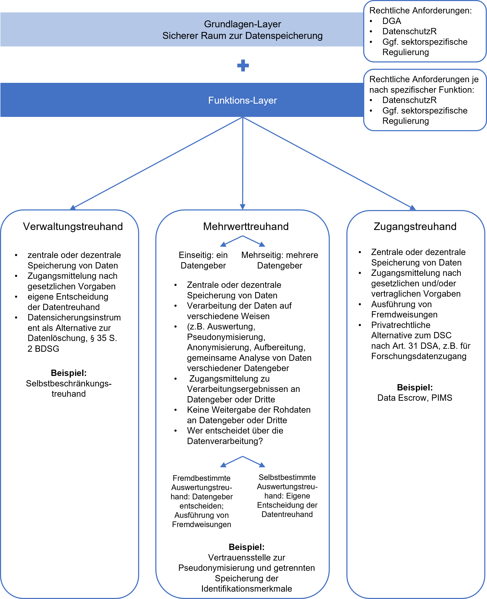

# A. Einleitung

Über den Begriff der Datentreuhand und die Reichweite seiner Bedeutung lässt sich trefflich streiten. Teilweise wird die Datentreuhand eng verstanden und mit Personal Information Management-Systemen (PIMS) gleichgesetzt. Danach soll ein Datentreuhänder Individuen ermöglichen, ihr Recht auf informationelle Selbstbestimmung insbesondere gegenüber Unternehmen, die Daten sammeln und ein darauf aufbauendes Geschäftsmodell verfolgen, durchzusetzen. Andere verstehen Datentreuhänder als Intermediäre, die in neutraler Funktion als Dritte auftreten, um den Datenaustausch dort zu fördern, wo er gegenwärtig aufgrund von Rechtsunsicherheiten oder konkurrierenden Marktpositionen nicht stattfindet. Hierbei sollen sie als vertrauenswürdige Stellen agieren, die nach klar definierten Regeln den Austausch ermöglichen, um dadurch insgesamt den in Daten befindlichen gesellschaftlichen und ökonomischen Wert besser erschließen zu können. In diesem Kontext werden Datentreuhandmodelle auch als eine Organisationseinheit diskutiert, die Daten zu gemeinwohlfördernden Zwecken verwaltet. Hierbei lässt sich an Mobilitäts- bzw. Fahrzeugdaten, Gesundheitsdaten oder auch Finanzdaten als mögliches Verwaltungsobjekt denken. Der Datentreuhänder kann hierbei neben der Verwaltung der Daten auch verschiedene weitere Aufgaben übernehmen, je nach Anwendungsbereich und Bedarf, bspw. Anonymisierung oder Veredelung von Daten, ohne seine Neutralität zu gefährden.[^1]

Das hier zugrunde gelegte Verständnis der Datentreuhand versucht, die verschiedenen Auffassungen bzw. Ansätze unter ein möglichst breitgefasstes Begriffsverständnis zusammenzufassen, das gerade nicht vom zivilrechtlichen Verständnis einer Treuhand ausgeht, sondern vielmehr von ihrer realweltlichen Bedeutung. Zweck ist es, den Blick auf die Datentreuhand nicht von vornherein zu verengen, sondern sämtliche Potentiale aber auch Problempunkte dieses vielfach mit unterschiedlichen Bedeutungen unterlegten diskutierten Instituts identifizieren und analysieren zu können. Dies soll auch helfen, der gesellschaftspolitischen Diskussion um die Datentreuhand eine Systematik zu geben, um den Diskussionsgegenstand letztlich besser und eindeutiger fassen und bewerten zu können.

Dieses breite realweltliche Verständnis geht von folgender Bedeutung der Datentreuhand aus:

>„Eine Datentreuhand eine natürliche oder juristische Person oder eine Personengesellschaft, die mindestens den Zugang zu von Datentreugebern bereitgestellten oder bereitgehaltenen Daten oder Datenanalyseergebnissen nach vertraglich vereinbarten oder gesetzlich vorgegebenen Regelungen (zumindest auch) im Fremdinteresse an Datennehmer mittelt." [^2]

Die so verstandene Datentreuhand verfügt in der Regel über einen Grundlagen-Layer, in dem eine sichere Verarbeitungsumgebung für Daten bereitgehalten wird. „Sicher“ bedeutet, das höchste Anforderungen an die einzuhaltenden technisch-organisatorischen Maßnahmen gestellt werden, die idealerweise durch den Gesetzgeber und Normungsinstitutionen vorgegeben werden. Hier können Daten entweder (bestenfalls zeitlich begrenzt) zentral zusammengeführt oder aber auch dezentral gehalten werden.[^3] Werden sie beispielsweise im Wege des Federated Learnings verarbeitet, dient der Grundlagen-Layer der Speicherung von Auswertungsergebnissen, des Auswertungs-Algorithmus oder aber der Metadaten. Im Funktions-Layer hingegen differenzieren sich die verschiedenen Datentreuhandmodelle aus. Es lassen sich drei Grundmodelle unterscheiden: Die Verwaltungs-Treuhand, die Mehrwert-Treuhand und die Zugangs-Treuhand. Die Verwaltungs-Treuhand entscheidet anstelle des Datentreugebers aber in dessen Interesse über den Zugang zu den von ihr verwalteten Daten. Dies kann beispielsweise dann sinnvoll sein, wenn ein datenschutzrechtlich Verantwortlicher die Erfüllung von Betroffenenrechten, wie des Auskunftsanspruches, durch Dritte erbringen lassen möchte. Die Betroffenendaten würden im technisch-faktischen Zugriffsbereich der Datentreuhand gespeichert und die Treuhand würde nach den gesetzlichen Vorgaben darüber entscheiden, welche Daten wann an welchen Betroffenen wie übermittelt würden. Dies kann sinnvoll sein, um Kosten im eigenen Betrieb zu sparen, indem man die Erfüllung der Betroffenenrechte an einen externen Diensteanbieter wie die Datentreuhand auslagert. Möglich erscheint die Inanspruchnahme einer Verwaltungs-Treuhand auch zu Zwecken der Selbstbeschränkung im Zugriff und damit als technisch-organisatorische Maßnahme. Die Verwaltungs-Treuhand könnte die Daten beispielsweise nach den Vorgaben eines Löschkonzeptes automatisiert löschen und den Zugriff nach Ablauf einer bestimmten Zeit ausschließen.

Die Mehrwert-Treuhand ermöglicht hingegen die zentralisierte Datenauswertung nach den Vorgaben der Datentreugeber. Ein Beispiel ist die Datentreuhand des vom Bundesministerium für Bildung und Forschung geförderten Drittmittelprojektes DARE (Datentreuhandmodelle in Reallaboren). Ziel ist die Bereitstellung einer sicheren Verarbeitungsumgebung zur Auswertung beispielsweise medizinischer Daten zu Forschungszwecken. Die Mehrwert-Treuhand ermöglicht die Kombination verschiedener Datenbestände verschiedener Datenhalter, ohne dass diese die Daten real teilen müssten. Vielmehr sollen die verschiedenen Datentreugeber nicht real auf die Datenbestände der jeweils anderen Datentreugeber zugreifen können, sondern diese im Grundlagen-Layer der Mehrwert-Treuhand zusammenführen und im Funktions-Layer auswerten können. Zugriff erlangen die Beteiligten dann allein auf die Auswertungsergebnisse und auf den von ihnen selbst eingebrachten[^4] Datenbestand. Als Mehrwert-Treuhand fungieren auch die Vertrauensstellen, die im medizinischen Kontext Pseudonymisierungen vornehmen und die Pseudonyme anschließend z.B. an das Forschungsdatenzentrum mitteln. Zugangs-Treuhänder hingegen mitteln den Zugang zu den bei ihnen gespeicherten (Roh-)Daten. Der Unterschied zur Verwaltungs-Treuhand liegt darin, dass die Verwaltungs-Treuhand eine eigene Entscheidung im Interesse des Datentreugeber (z.B. zur Erfüllung seiner gesetzlichen Verpflichtungen) trifft, die Zugangs-Treuhand aber ausschließlich auf Weisung des Datentreugebers handelt. Hier dürften beispielsweise das Angebot von Streamr [^5] oder Datapods angesiedelt sein.[^6]

Die nachfolgenden rechtlichen Anforderungen trennen zwischen den möglichen Funktionen der verschiedenen Datentreuhand-Modelle, in der Praxis werden jedoch auch Mischformen von Verwaltungs-, Auswertungs- und Zugangs-Treuhand vorkommen, sodass die jeweiligen rechtlichen Anforderungen dann kumulativ vorliegen müssen. Stets jedoch agiert die Datentreuhand in einem Dreiecksverhältnis zwischen Datentreugeber und Datennehmer. Der Begriff des Datentreugebers umfasst zum einen die betroffene Person, die dem Datentreuhänder Zugang zu den sie betreffenden Daten verschafft, und zum anderen natürliche oder juristische Personen, die selbst keine betroffenen Personen sind, die dem Datentreuhänder aber dennoch Zugang zu personenbezogenen und/oder nicht personenbezogenen Daten verschaffen, z.B. ein Arbeitgeber, der Daten seiner Arbeitnehmer oder Sachdaten über seine Tätigkeiten in der Datentreuhand speichert, oder ein Gesundheitsdienstleister, der Patientendaten oder auch anonymisierte Daten zu Behandlungsabläufen in der Datentreuhand speichert.

Der Begriff des Datennehmers umfasst diejenigen natürlichen oder juristischen Personen, die personenbezogene und/oder nicht-personenbezogene Daten durch den Datentreuhänder aus der Datentreuhand real erhalten oder diese jedenfalls in einer geschützten Umgebung nutzen können.

# B. Gang der Untersuchung

Die folgenden Ausführungen dienen dazu, die Datentreuhand in ihren rechtlichen Rahmen einzuordnen, um hierauf aufbauend die für sie geltenden gesetzlichen Anforderungen des Daten- und Datenschutzrechts im Einzelnen zu adressieren und zu prüfen.

Dafür werden zunächst diejenigen datenschutzrechtlichen Anforderungen aufgezeigt, die für die Datentreuhand im Grundlagen- und Funktions-Layer gelten, deren Beachtung zentral für den praktischen Einsatz der Datentreuhand ist (siehe [Datenschutzrechtliche Anforderungen](../Datenschutzrechtliche%20Anforderungen)). Denn der Erfolg einer Datentreuhand hängt maßgeblich davon ab, ob und unter welchen Bedingungen sie datenschutzrechtskonform angewendet werden kann. Dabei wird auch auf die Vorgaben des TTDSG abgestellt, die für bestimmte Datentreuhandmodelle gelten. Anschließend werden die Anforderungen des Data Governance Acts an Datentreuhänder dargelegt (siehe [DGA-Anforderungen](../DGA-Anforderungen)).

# Fußnoten

[^1]: Zur gesamten Diskussion um verschiedene Verständnisse bzw. Erwartungen, die mit dem Begriff der Datentreuhand verbunden werden, siehe RfII – Rat für Informationsstrukturen: Datentreuhänder: Potenziale für wissenschaftskonformes Datenteilen – Herausforderungen für die institutionelle Ausgestaltung, RfII Berichte No. 5, 2023, insb. S. 6 ff und 31 ff. m.w.Nachw.

[^2]: Begriff nach _Specht-Riemenschneider/Blankertz/Sierek/Schneider/Knapp/Henne_, MMR- Beil. 2021, 25; _Blankertz_, Stiftung Neue Verantwortung, Designing Data Trusts, Februar 2020; zu weiteren Begriffsverständnissen vgl. Verbraucherzentrale Bundesverband e.V., Neue Datenintermediäre, 15.09.2020, abrufbar unter: [https://www.vzbv.de/sites/default/files/downloads/2020/04/06/20-02-19_vzbv-positionspapier_pims.pdf](https://www.vzbv.de/sites/default/files/downloads/2020/04/06/20-02-19_vzbv-positionspapier_pims.pdf), zuletzt abgerufen am: 31.10.2023; ausführlich: _Brockmeyer_, ZD 2018, 258 ff.; _Kühling_, ZfDR 2021, 1, 5; politisch gewollt ist jedenfalls die Förderung von Datentreuhändern, vgl. Datenstrategie der Bundesregierung, v. 21.01.2021, S. 36.

[^3]: Siehe dahingehende Unterscheidung bei PIMS: Verbraucherzentrale Bundesverband e.V., Neue Datenintermediäre, 15.09.2020, S. 6, abrufbar unter: [https://www.vzbv.de/sites/default/files/downloads/2020/04/06/20-02-19_vzbv-positionspapier_pims.pdf](https://www.vzbv.de/sites/default/files/downloads/2020/04/06/20-02-19_vzbv-positionspapier_pims.pdf), zuletzt abgerufen am: 31.10.2023.

[^4]: Ein Dateneigentum i.S.v. § 903 BGB existiert nicht, es geht allein um die technisch-faktische Einbringung eines Datenbestandes, nicht um die Einräumung rechtlicher Verfügungsmacht.

[^5]: Siehe [https://streamr.network](https://streamr.network), zuletzt abgerufen am 31.10.2023.

[^6]: Siehe [https://www.datapods.app](https://www.datapods.app), zuletzt abgerufen am: 31.10.2023.
