# 1. Struktur eines DTH User Interface

## Das Grundkonzept

Eines der wichtigsten Prinzipien einer DTH-Plattform ist das Verhindern von unbefugtem Zugriff / unbefugter Manipulation von Daten. Um dies zu gewährleisten werden klare Strukturen benötigt, die es dem Nutzer ermöglichen, einzusehen und zu entscheiden, wer Daten beziehen bzw. bearbeiten darf. Dies muss durch eine bewusste  **Zustimmung (Consent) und Ablehnung der Anfrage**  geschehen. Das Interface bzw. das Interaktionskonzept der Anwendung muss hierbei Mittel und Wege liefern, mit denen das Ziel "Zustimmung erteilt/abgelehnt" erreicht werden kann.

Die Prinzipien die darauf folgen sind ebenfalls notwendig, damit der Nutzer die Plattform sinngemäß bedienen kann. Er benötigt eine Oberfläche, die ihm zeigt, welche Zustimmungen erteilt worden sind und welche Anfragen (von Dritten) eingegangen sind. Wie diese dargestellt werden ist konzept- und domänenabhängig. In diesem Kapitel werden Beispiele vorgestellt. Die erteilten Zustimmungen können auf verschiedenen Art und Weisen abgebildet werden. Je nach Kontext kann es sinnvoll sein, auch mehrere Arten der Abbildungen einzusetzen. Eine der relevanten Fragen dahinter ist: "Sieht der Nutzer alle Datenflüsse, denen er zugestimmt hat, und sieht er auch welche Unternehmen an diesen beteiligt waren?".

Dabei kann der Einsatz von mehreren Funktionen bzw. mehreren Screens zur Darstellung der "Zustimmung" eine Möglichkeit sein:

-   **Daten Screen:**  
    Welche Daten sind vorhanden mit der optionalen Ergänzung: Wer hat Zugriff darauf?
-   **Datennutzer Screen:**  
    Welche Datennutzer haben eine Zustimmung erhalten und zu welchen Daten besteht diese?

Datentreuhänder Plattformen können in verschiedenen Domänen eingesetzt werden, wodurch auch verschiedene Arten von Daten und Datenübertragungen stattfinden. Die Herausforderung beim UX und UI Design besteht darin, die korrekte der Darstellung für den gewählten Anwendungsfall zu finden. Geht es um rein textuelle Daten, so macht es beispielsweise wenig Sinn, eine Funktion einzubauen, mit der man eine Nutzungszustimmung wieder entziehen kann. Geht es um Daten die gestreamt werden (Videos, Musik, ein dauerhafter Abruf von Sensordaten), dann kann so eine Funktion durchaus sinnvoll sein.

Die folgenden Kapitel gehen auf die einzelnen Bausteine der DTH-GUI ein und beschreiben die Prozesse die darauf abgebildet werden.

## Grundsätzlicher Aufbau der Anwendung

Der Aufbau eines DTH folgt den gleichen Prinzipien, die auch bei anderer Software angewendet werden. Das Bild  [Aufbau und Struktur eines DTH](img_1.png)  zeigt den grundsätzlichen Aufbau eines DTH Konzepts. Ein Nutzer startet auf einer Seite, die ihm eine Übersicht über die Funktionen gibt (bspw. eine Menü- oder Navigationsstruktur) (in der Grafik als  **Ebene 1**  markiert).

Darauf folgen die für die Nutzung primär vorgesehenen Funktionen (in der Grafik als  **Ebene 2**  markiert). Diese Bereiche stellen die Funktionen bereit, die zum Lösen der Herausforderung dienen, die ein Nutzer hat.

Alle Funktionen, die zur Verwaltung des Nutzeraccounts oder Einstellungen im System vorgesehen sind, bzw. zum aufrufen von Handbüchern oder Nice-to-Have Features genutzt werden, werden auf  **Ebene 3**  gelistet. Diese Funktionen werden nicht über das Hauptmenü, sondern über klassische Elemente wie das Nutzer Icon im Headerbereich oder über Untermenüs, Buttons, etc. in Funktionen der Ebene 2 aufgerufen.

Zu den Kernfunktionen eines DTH zählen:

-   Datennutzer Verwalten
-   Datenfreigabe Verwalten
-   Datensätze Verwalten

Weiterhin sollte das System Funktionen liefern, die dem Nutzer zeigen, dass seine Daten sicher sind. Also Funktionen, die Vertrauen erwecken. Wichtig hierbei sind:

-   Hinweise zu aktuellen Gefahren, die der DTH identifiziert hat (Datenleaks, unseriöse Anfragen, etc.)
-   Klare Strukturen, die den Datenverkehr übersichtlich und schnell begreifbar machen.

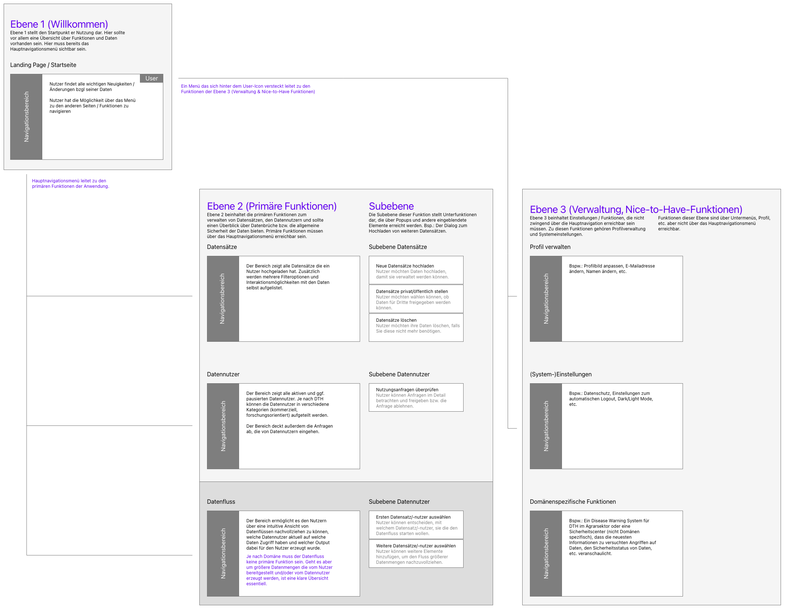

## Landing Page

Die Landing Page ist der Startpunkt für Nutzer und ist vor allem dazu da, diese "abzuholen". Ihnen also zu zeigen, was mit dem DTH möglich ist (in Form einer Menüstruktur), aber auch um über die neuesten Anfragen, Änderungen bzw. Updates im allgemeinen. zu informieren. Wie die Nutzer informiert werden kann auf unterschiedliche Art und Weisen gelöst werden, bspw.:

1.  Auf dem Screen der Landing Page ist ein  **extra Bereich** für Updates. Dieser Bereich nimmt dann den Großteil des Screens ein.
2.  Updates werden ausschließlich über ein  **Notification Icon**  (bspw. eine "Glocke") bereitgestellt.
3.  Auch Kombinationen aus beidem sind denkbar. So können dauerhaft relevante Informationen im Hauptbereich angezeigt werden und wichtige Meldungen, die nicht zu diesem Inhalt passen, werden über das Notification Icon aufgerufen.

Unabhängig von der Entscheidung welche Variante eingesetzt wird, wird eine Menüstruktur benötigt. In unseren Beispielen (siehe Bild [Landing Page (Überblick)](img_2.png)) hat sich ein Navigationsmenü in der linken Sidebar angeboten (mehr dazu weiter unten). Prinzipiell ist dies aber eine Design Entscheidung, die zum Workflow und zur Unternehmens CI passen muss. Während bei Variante 1 und 3 auf der Landing Page tatsächlich Platz benötigt wird, bietet Variante 2 den Vorteil, dass kein Platz auf dem Screen benötigt wird. Die Updates werden nur in einem Benachrichtigungsfenster angezeigt, das sich bei Bedarf durch ein Popup über andere Screenelemente legt. Wird auf eines der Updates geklickt, wird man direkt zu der Funktion navigiert, die von dem Update betroffen ist.

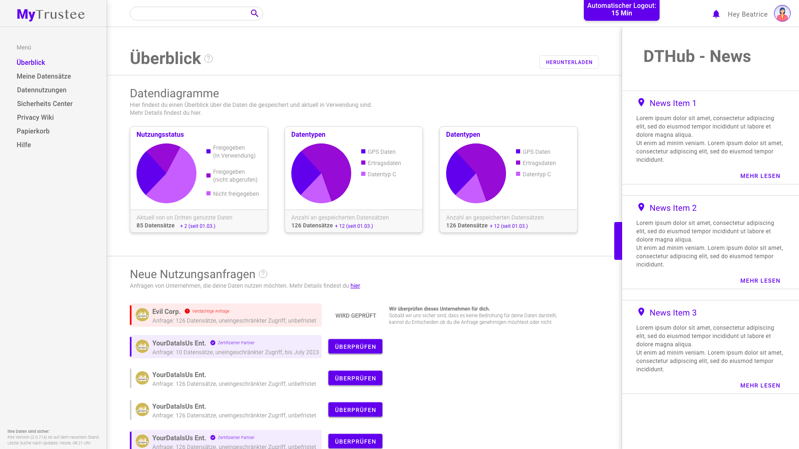

### Headermenü

#### Nutzerinformation

Die Nutzer- bzw. Accountinformationen werden, wie mittlerweile üblich, auch im Header, am rechten Rand des Screens platziert. Die Funktionen dahinter können sich auf Account- und Profil-Einstellungen beziehen oder die allgemeinen Einstellungen das Systems beinhalten. Auch ein Logout-Button wäre an dieser Stelle denkbar.

#### Notifications

Auf der rechten Seite des Headermenüs befindet sich eine Glocke. Die Glocke zeigt über eine Zahl an, ob es neue Notifications gibt. Ein Klick auf das Element öffnet ein Popup, in dem die Details zur Notification aufgelistet sind. Die Elemente in diesem Popup sollten zur jeweiligen Stelle, an der es konkrete ToDos gibt, verknüpft sein. Bild [Notification Schema](img_3.png)  zeigt das Konzept dahinter.

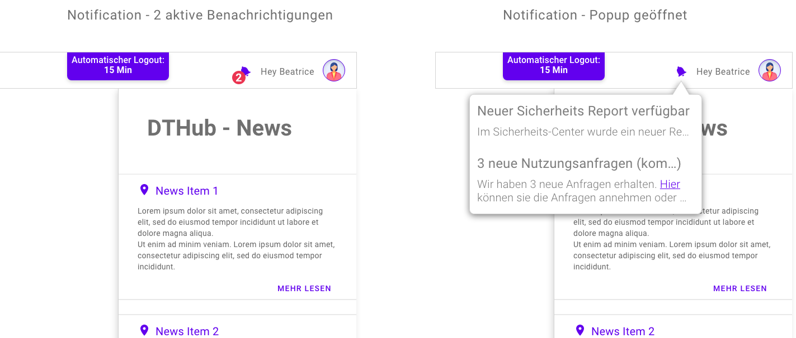

#### Weitere Elemente

Es sind weitere Elemente denkbar, die entweder das Arbeiten innerhalb des DTH einfacher bzw. angenehmer für den Nutzer machen, oder dessen Sicherheitsgefühl stärken. Zu diesen gehören:

-   **Suchfunktion**  
    Eine Suche ermöglicht es Nutzern schnell das zu finden, wonach sie suchen. Auch wenn sie es gerade über die Navigationsstruktur der Anwendung nicht finden können.
-   **Logout-Timer**  
    Ein automatischer Logout vermittelt ein Gefühl von Sicherheit. Faktisch ist es auch sicherer, dass man automatisch ausgeloggt wird, falls der Nutzer selbst es vergisst. Dem Nutzer zu zeigen, wann der Logout eintritt, macht ihn aktiv darauf aufmerksam, dass er an dieser Stelle sicher ist. Die Dauer das Timers ist im Beispiel mit 15 Minuten angegeben. Eine sinnvolle Dauer kann nur durch User-Research festgestellt werden.
-   **(Optional) Einklappbare Sidebar**  
    Gibt es einen erhöhten Informationsbedarf, bspw. über ein Newsportal, ist dies über einklappbare Elemente denkbar. Im Beispiel wird das auf der Rechten Seite durch ein News-Hub angedeutet.

### Sidebarmenü

Die Sidebar beinhaltet in unserem Beispiel das Menü, also die primäre Navigationsstruktur. Die Entscheidung dafür, wo das Menü platziert wird, hat keinen Einfluss auf die Qualität der DTH an sich, so lange sie für den Nutzer effektiv, effizient und zufriedenstellend umgesetzt ist. Eine Navigationsleiste im Kopfbereich kann genauso gut verwendet werden. Als Orientierung, wo ein solches Menü platziert werden soll, können bekannte Muster wie das  [F-Pattern (externer Link)](https://www.nngroup.com/articles/f-shaped-pattern-reading-web-content/)  hilfreich sein.

Die Entscheidung, das Menü in eine Sidebar zu packen wurde vor allem daher getroffen, da viele Tabellen bzw. tabellenähnliche Ansichten im DTH eingesetzt werden. Tabellen eigenen sich sehr gut als Grundform der Darstellung von großen Datenmengen. Die Sidebar bietet aber weiterhin die Vorteile, dass neben dem Menü auch verschiedene Informationen, wie zum Beispiel der Zustand der Software gegeben werden kann. In unserem Beispiel wird im unteren Bereich der Sidebar immer darüber informiert, ob die gerade verwendete Software die aktuelle Version ist oder ob es eine neuere Variante gibt. Die trägt zum Sicherheitsgefühl der Nutzer bei. Dies ist ein Beispiel, dass bei Web-Anwendungen sicherlich weniger nützlich ist, als bei lokal installierten Programm auf dem Computer des Anwenders, dennoch kann es in beiden Fällen positive Effekte erzeugen.

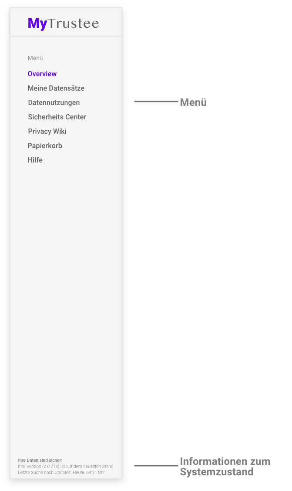

**Anmerkungen:**

-   **Welche Elemente im Menü gelistet werden sollen ist abhängig von mehreren Entscheidungen.** Zum einen muss klar sein, ob die Navigationsstruktur so komplex ist, dass auch Untermenüs abgebildet werden müssen. Evtl. wird ein Design gewählt, dass die Funktionen sehr übersichtlich auf der Hauptseite darstellt oder es sind immer nur sehr wenige Funktionen und Untermenüs lohnen sich nicht. Dann stellt sich noch Grundsätzlich die Frage, welche Funktionen die wirklichen Kernelemente des DTH sind. Funktionen, die das Verwalten von Daten und Datennutzern ermöglichen gehören vermutlich aber immer dazu und bilden eine Art Grundpfeiler.

## Übersicht über vorhandene Daten (Daten Screen)

### Datenansicht

Nutzer eines DTH benötigen eine Übersicht über alle Daten, die sie auf der Plattform hochgeladen haben. Im Grund eignet sich hierfür eine Tabelle. Die Wahl der Informationen, die in den Spalten dargestellt werden ist für den Grundaufbau verschiedener DTH sehr ähnlich. Je nach Domäne bzw. Art des Datentreuhänders können aber einzelne, spezifische Informationen von einander abweichen oder ergänzt werden.

Abgesehen davon, dass der Nutzer eine Übersicht benötigt, die im zeigt, welche Daten sich in seinem DTH-Account befindet können ihm Mehrwerte durch weitere Details zu den Daten gegeben werden:

-   **Gesamtzahl an Datennutzern, die Zugriff auf das Dokument hatten**  
    Auf der rechten Seite der Tabelle im Bild  [Übersicht der Datensätze mit wichtigen Hervorhebungen](img_5.png), wird der Nutzungsstatus angezeigt. Ein rundes Icon symbolisiert über Farben (grün, orange, rot) ob überhaupt eine Nutzung aktiv ist. Also ob Datennutzer Zugriff auf die Daten haben. Dieser Status ist vor allem bei kontinuierlich gestreamten Daten relevant, da der Nutzer direkt erfassen kann, welche Daten geteilt werden und welche nicht. Ein zusätzlicher, numerischer Indikator, gibt Auskunft darüber, wie viele Nutzungen es insgesamt gab.
-   **Anzahl der aktuell aktiven Nutzungen (nur bei Daten die kontinuierlich gestreamt werden)**  
    Die Gesamtzahl an Datennutzern kann durch die Auflistung der aktuell aktiven Nutzungen weiter aufgewertet. Es ist auch denkbar, dass der klick auf solch ein Element alle aktiven Datennutzer anzeigt. Der Bereich Gesamtzahl an Datennutzern wurde im Beispiel um die aktiven Nutzungen ergänzt. Dafür wurde die Schreibweise X Datennutzer von der Gesamtzahl an Datennutzern dieses Datensatzes haben noch Zugriff (_x/Gesamtzahl_) verwendet. Siehe Bild  [Erklärung zum Nutzungsstatus](img_6.png).
-   **Hervorheben von Daten(sätzen) bei denen es Handlungsbedarf gibt**  
    Im nächsten Kapitel (Datennutzer) wird über die Möglichkeit gesprochen, dass der DTH Datennutzungsanfragen bewerten kann. Dies hilft dabei, verdächtige Anfragen als Nutzer einfacher zu erkennen. Es ist denkbar, dass die betroffenen Dateien einer solchen, verdächtigen Anfrage auch in der Tabelle der Datensätze markiert wird. Dies kann dem Nutzer bei der Entscheidung helfen, ob die Anfrage wirklich unseriös ist oder nicht, da er beispielsweise ein bestimmtes "Abfragemuster" erkennen kann.  
    Genauso können aber auch Daten markiert werden, bei denen es zu Problemen beim Upload kam, deren Quelle nicht nachvollzogen werden kann etc. Der wichtige Aspekt der hier vermittelt werden soll ist, dass die Ansicht der Datensätze nicht nur eine statische Tabelle ist, sondern auch  **wichtige Hinweise für den Nutzer**  beinhalten kann. Im Beispiel (Bild  [Übersicht der Datensätze mit wichtigen Hervorhebungen](img_5.png)), werden diese Hervorhebungen durch orange und rote Icons auf der linken Seite der Tabelle verwendet. Die linke Seite wurde daher gewählt, da dieser Bereich von Nutzern prinzipiell vor dem restlichen Inhalt wahrgenommen wird. Es ist also ein geeigneter Platz für wichtige Hinweise (vgl.  [F-Pattern (externer Link)](https://www.nngroup.com/articles/f-shaped-pattern-reading-web-content/)).
-   **Datum der letzten Aktivität**  
    Eine Aktivität kann in fast allen Fällen die letzte Abfrage oder die Bereitstellung des Datensatzes durch den Datennutzer sein. Je nach Kontext in der sich der DTH befindet können dies aber auch andere Aktivitäten sein. Z.b. kann hier gezeigt werden, ab wann ein Daten zum Datennutzer gestreamt werden (bspw. von einem Sensor, der die Feuchtigkeit des Bodens misst).
-   **Datentyp (Data Item Type)**  
    Der Datentyp kann vom Nutzer beim Upload der Daten oder automatisch durch das System (mit Kontrolle des Nutzers) festgelegt werden. Er soll dem Nutzer eine bessere Übersicht über die Daten gewährleisten. Ob dies einen Nutzen hat, ist von der Domäne/ dem Kontext des DTH abhängig.

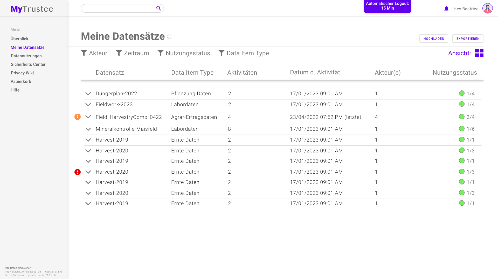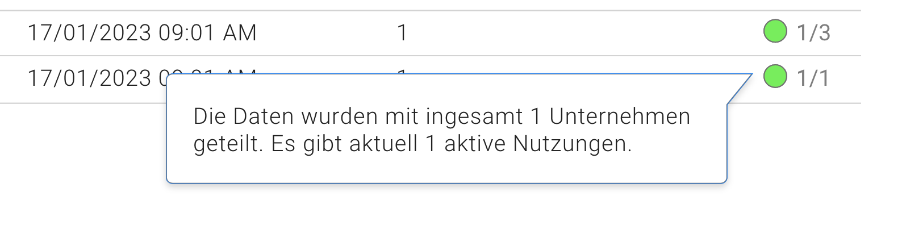

### Interaktion und Details zu Datensätzen

Um weitere Details zu einem Datensatz einsehen zu können und um mit ihm interagieren zu können, kann jeder Datensatz über ein Dropdown-Element erweitert werden. Hier wären auch andere Interaktionskonzepte denkbar. Bspw. die Verwendung von Modals. Öffnet man das Dropdown-Element werden alle Aktivitäten sowie das Datum der Aktivität detailliert angezeigt. Auch, von wem die Aktivität durchgeführt wird bzw. wurde.

Auf der linken Seite des aufgeklappten Datensatzes wird ein Interaktionselement eingeblendet, über das Dateien eingesehen (Brille), für Datennutzer komplett gesperrt (Schloss), heruntergeladen (Download Symbol) oder gelöscht (Papierkorb) werden können. Löschen und Sperren sollte über eine weitere Abfrage des Systems vom Nutzer bestätigt werden. Bild  [Dateilansicht eines Datensatzes](img_7.png)  zeigt die Details und Interaktionselemente der einzelnen Datensätze.

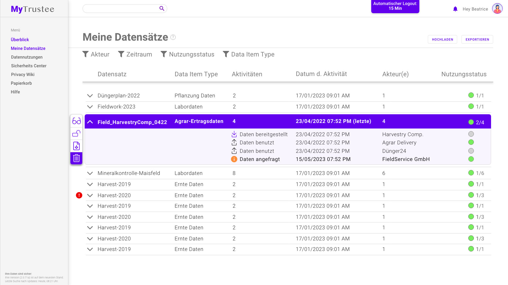

### Datenansicht Variante: Gruppenansicht

Als weitere Variante der Ansicht von Daten und Datensätzen ist eine Gruppenansicht denkbar. Der Nutzer könnte bspw. auf Basis von fest definierten Gruppen, die das System vorgibt, Dateien einsortieren oder sich selbst Gruppen erstellen. Ob diese Variante sinnvoll ist hängt vom Kontext der Anwendung ab: Gibt es so viele unterschiedliche Daten, dass sich die Gruppen lohnen? Wird bei der Datenmenge die der Nutzer hochlädt überhaupt eine Gruppierung benötigt, oder gibt die Datenmenge das nicht her? etc. Bild [Gruppenansicht der Datensätze](img_8.png)  zeigt, wie so ohne Gruppierung im Falle eines DTH im Agrarsektor aussehen könnte.

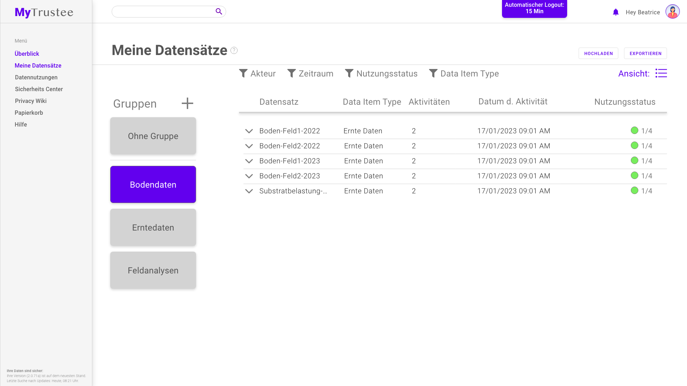

#### **Anmerkungen:**

-   Sind unter den Datensätzen individuelle Dateien, die einmal abgelegt werden und Dateien, die kontinuierlich ergänzt werden (auf der rechten Seite der Tabelle im Bild  [Übersicht der Datensätze mit wichtigen Hervorhebungen](img_5.png)), ist es ratsam auch hier eine klare Unterscheidung zu treffen. Ein Indikator für den Nutzungsstatus kann hier pro Datei-Art unterschiedlich gestaltet werden, um klar differenzieren zu können.

### Neue Daten als Nutzer hochladen

Das Grundprinzip zum Hochladen von Daten ist bereits in vielen anderen Anwendungen erprobt. Ein Uploadbereich, der per Click auf einen Button die Dateiauswahl auf dem Computer zulässt ist genauso effektiv wie ein Feld, in den Daten per Drag & Drop hineingezogen werden können. Für das hier betrachtete Beispiel geschieht der Upload in vier Schritten, die auch im Bild [Prozess des Datenuploads](img_9.png)  dargestellt werden:

1.  **Auswahl**  der hochzuladenden Dateien
2.  **Überprüfen**  der ausgewählten Dateien
3.  **Upload**  Prozess mit dem Einsatz weiterer Features (siehe Kapitel "Weitere Features zum Dateiupload")
4.  **Abschluss**  des Uploads

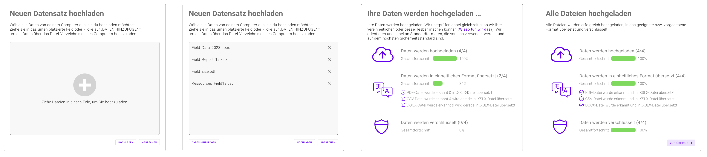

Zusätzlich zum "bekannten" Upload-Prozess kann auch der  **Upload von Anlogen Daten**, Fotos, etc. angeboten werden. Je nach Einsatzzweck bzw. Domäne des DTH kann dies für Nutzer echte Vorteile bieten. Vor allem für die Nutzer, die bisher viel auf Papierbasis gearbeitet haben und jetzt möglichst stressfrei den Wechsel zu einer digitalen Lösung anstreben. Neben den Vorteilen, die zu solch einer Entscheidung geführt haben (bspw. das sichere und schnelle Teilen von Dateien mit Datennutzern), ermöglichen solche Elemente, die als "Convenience Funktion" angesehen werden können einen einfacheren Übergang zu einem DTH. Das Bild zeigt eine exemplarische Aufteilung in den analogen und digitalen (vom eigenen Computer) Upload. Die Prozesse hinter dem analogen Upload sehen ähnlich aus. Nach einer Aufnahme über die Kamera des genutzten Gerätes werden auch diese Dateien über den gleichen Prozess hochgeladen.

**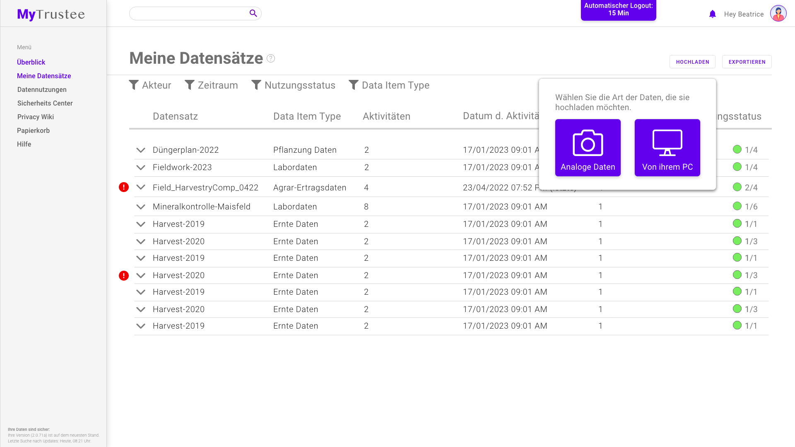**

#### Weitere Features zum Dateiupload

-   **Automatische Kategorisierung von Daten**  
    Über erweiterte Funktionen können Prozesse für den Nutzer vereinfacht werden. Hochgeladene Dateien könnten beispielsweise  **automatisch kategorisiert** werden. Dies setzt voraus, dass Dateiarten und Kategorien vom DTH bekannt sind. Es ist also eine Funktion, die abhängig von der Domäne und dessen Anforderungen abhängig ist.
-   **Verschlüsseln von Daten**  
    Um das Sicherheitsgefühl und Vertrauen der Nutzer zu stärken kann der DTH direkt beim Upload eine Verschlüsslung anbieten. Dies sollte voll automatisch passieren, ohne dass ein Nutzer selbst viel konfigurieren muss. Eine initiale Abfrage des Nutzers, ob er seine Daten verschlüsseln möchte und eine Option die Entscheidung in den Einstellungen zu ändern sind essentiell.
-   **Vereinheitlichen von Dateitypen**
    Um das weitere Verarbeiten von Daten (auch durch Datennutzer) zu vereinfachen, kann eine Vereinheitlichung von Dateitypen angeboten werden. Auch hier sollte der DTH dies automatisch und durch wenige initiale Einstellungen ermöglichen. Es können nicht alle Dateitypen vereinheitlicht werden. Formate die aber bspw. Tabellen enthalten, können auf einen einzigen Dateityp vereinheitlicht werden, was die Nutzung vereinfacht.

## Datennutzer (Datennutzer Screen)

### Datennutzungsanfragen

Wie im Grundkonzept erwähnt, müssen die Nutzungsanfragen für Daten, egal ob es um das Bereitstellen oder Erhalten von Daten geht, vom Besitzer des DTH-Kontos überprüft werden. D.h. er kann Ihnen zustimmen, oder sie ablehnen. In anderen DTH-Konzepten ist auch eine aktive Anfrage vom Nutzer, an Dritte denkbar. Wir fokussieren uns aber auf Anfragen, die an den Nutzer gestellt werden.

Anfragen, die von potentiellen Datennutzern gesendet werden, werden in unserem Beispiel auf der Landing Page des DTH bereits aufgelistet. Dieses Platz ist aber vor allem für neue, bisher noch nicht bearbeitete oder gesehene Anfragen gedacht, über dem Nutzer eine Übersicht über die aktuellen Geschehnisse zu geben. Unter dem Menüpunkt "Datennutzungen" werde alle Anfragen, unabhängig davon, ob sie neu oder bereits bei der letzten Nutzung eingesehen wurden, aufgelistet. Dafür ist der obere Bereich des Screens vorgesehen. Auf die Anfragen folgt eine Übersicht über alle Datennutzer (siehe Folgekapitel). Je nach Anwendungsfall, in dem ein DTH benutzt wird, kann bzw. sollte hier eine andere Designentscheidung getroffen werden. Wird davon ausgegangen, dass es sehr viele Anfragen an den Nutzer geben wird, sollten diese auf eine separate Seite ausgelagert werden. Damit gibt man den Anfragen ausreichen Platz und verhindert gleichzeitig, dass die Übersicht über die Datennutzer zu weit nach unten geschoben wird und sie vom Nutzer evtl. gar nicht wahrgenommen wird. Auch hier gilt: Es gibt unterschiedliche Designentscheidungen, wie dies gelöst werden kann. Das Bild  [Datennutzungsscreen mit Nutzungsanfragen und der Datennutzerübersicht](img_11.png)  zeigt eine beispielhafte Variante, wie der Screen aufgebaut werden kann.

Für die Nutzungsanfragen in einer DTH Anwendung müssen zumindest zwei Funktionen abgedeckt werden müssen:

1.  Eine  **Übersicht über alle getätigten Anfragen**, um diese ggf. wieder zu entziehen (bei kontinuierlichen Datenstreams).
2.  Eine  **Detailansicht für Anfragen**, die dem Nutzer erklärt, von wem eine Anfrage getätigt wurde und welche Daten, ggf. für einen bestimmten Zeitraum, davon betroffen sind.

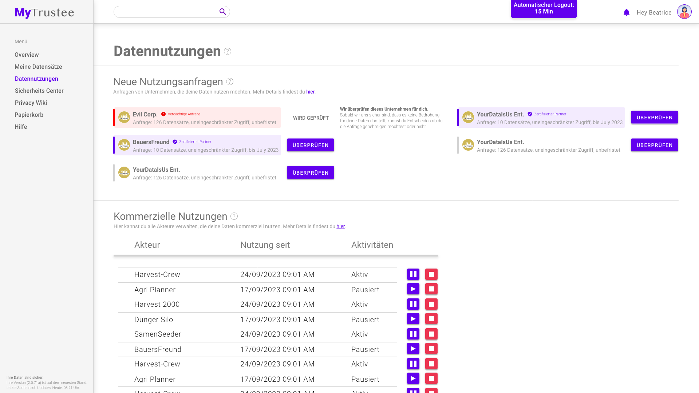

Ein weiterer relevanter Aspekt für das Verwalten von Nutzungsanfragen (und Daten an sich) sind die Art der Daten, die über den DTH verwaltet werden. Es gibt Dateien die regelmäßig erweitert werden können, um Durchschnittswerte, Jahresmittel, etc. zu ermitteln. Für  **Daten die regelmäßig bearbeitet/ergänzt werden**, bei denen also ein dauerhafter Stream von Informationen vorhanden ist, reicht es nicht nur eine Nutzungsanfrage zu genehmigen oder abzulehnen. Hier kann es für den Nutzer auch relevant sein, einen bestimmten Zeitraum festzulegen, in dem Dritte einen Zugriff haben. Zumindest sollte aber die Möglichkeit bestehen, auch nach einer Zusage, die Nutzungserlaubnis wieder zu entziehen. Auf das Konzept der Streamingdaten wird im weiteren Verlauf dieses Dokuments zurück gegriffen. Es kann aber auch mit Daten gearbeitet werden, die ein Mal erstellt und dann nicht weiter angefasst werden. Bei einfachen Daten, die einmal zu Dritten gesendet oder von diesen Empfangen werden, ist so eine Funktionalität nicht notwendig.

#### Prozess des Dialogkonzepts zur Nutzungsfreigabe

Das Dialogkonzept der Nutzungsanfragen und -freigaben kann über die folgenden Schritte (siehe Bild  [Prozess des Dialogkonzepts der Nutzungsfreigabe](img_12.png)) dargestellt werden:

1.  Eine Anfrage durch Datennutzer für einen oder mehrere Datensätze geht ein.
2.  Das System (die DTH-Plattform) erhält die Anfrage.
    1.  Das System überprüft die Anfrage und ordnet sie ggf. einer Kategorie zu.
    2.  Das System informiert den Nutzer über die Anfrage. Bei einer längeren Überprüfung wird der Nutzer über diese informiert und hat noch keine Interaktionsmöglichkeiten.
3.  Das System leitet die Anfrage nach der Überprüfung zur Freigabe durch den Nutzer weiter.
4.  Der Nutzer trifft die Entscheidung ob die Anfrage angenommen oder abgelehnt wird.
5.  Je nach Nutzerentscheidung erledigt das System einen der beiden Schritten:
    1.  Das System gibt die angefragten Daten an den Datennutzer frei.
    2.  Das System lehnt die Anfrage ab.

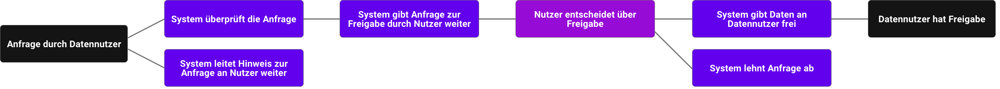

#### **Anmerkung:**

-   Diese Darstellung stellt nur das Dialogkonzept für eine Nutzungsanfrage dar. Sie steht in keinem Zusammenhang mit der Softwarearchitektur die benötigt wird, um solche Anfragen zu bearbeiten.

#### Kategorien der Nutzungsanfragen

Die Nutzungsanfragen können Kategorisiert werden. Kategorien können beispielsweise Standanfragen von Datennutzern sein, die nicht bekannt sind; Anfragen von zertifizierten Datennutzern, die der DTH als Vertrauenswürdig einstuft; als verdächtig markierte Anfragen, da der DTH die Nutzungsanfrage als ungewöhnlich eingestuft hat. Diese Kategorien sollten recht allgemeingültig und in vielen Fällen einsetzbar sein. Der Einsatz dieser Kategorien schafft beim Nutzer der DTH ein Sicherheitsgefühl: Die DTH-Plattform ergreift proaktiv die Initiative und warnt den Nutzer wenn etwas nicht ok ist. Diese schafft zusätzlich auch Vertrauen vom Nutzer in den DTH selbst. Es gilt zu beachten, dass die Umsetzung und auch Durchführung solcher Funktionen mit einem erhöhten Aufwand verbunden ist. Anfrage müssen manuell und automatisch kontrolliert und die Datennutzer dahinter überprüft werden.

Die folgenden drei Unterkapitel veranschaulichen die 3 genannten Kategorien mit einem Beispiel:

##### Standardanfrage

Im Standardzustand wird in Fett das Unternehmen angezeigt, dass eine Anfrage schickt. Dazu gibt es eine kurze Übersicht darüber, wie viele Daten über welchen Zeitraum angefragt werden. Über den Button „Überprüfen“ kann Der Nutzer die Anfrage überprüfen und annehmen bzw. ablehnen.

##### Anfrage von zertifiziertem Datennutzer

Unternehmen können sich beim Treuhänder zertifizieren. Sie gelten dadurch als vertrauenswürdig und werden für den Nutzer positiv hervorgehoben. Sie erhalten ein Siegel „Zertifizierter Partner“. Der Nutzer muss hier dennoch die Freigabe über „Überprüfen“ selbst starten.

##### Anfrage von einem verdächtigen oder dem DTH nicht bekannten Datennutzer

Verdächtige Anfragen werden vom System in rot hervorgehoben. Sie werden mit einer Warnung versehen und können vom Nutzer nicht direkt überprüft werden. Solche Anfragen werden zuerst vom Treuhänder geprüft und ggf. automatisch entfernt. Der Nutzer fühlt sich hierdurch sicherer, da er gewarnt wird und ihm die erste kritische Entscheidung abgenommen wird.

### Detailansicht der Nutzungsanfragen

Für das Annehmen bzw. Ablehnen von Anfragen ist ein Modal vorgesehen, dass dem Nutzer alle relevanten Informationen zur richtigen Entscheidung liefert. Zusätzlich kann ein DTH dadurch aufgewertet werden, dass er dem Nutzer eine Empfehlung, auf Basis der bisherigen Informationen zur Art der Anfrage und über den Datennutzer, gibt. Diese erweiterte Funktionalität ist mit einem erhöhten Aufwand verbunden und kann die Kosten für den Betrieb des DTH erhöhen. Die beiden Bilder zeigen eine Datennutzungsanfrage eines kommerziellen Datennutzers.

Das Bild  [Verdächtige Nutzungsanfrage](img_16.png) zeigt eine Anfrage die vom DTH als verdächtig eingestuft wurde. Alle verdächtigen Elemente der Anfrage werden rott markiert. Die Zusammenfassung des DTH weißt auf die potentielle Gefahr hin. Dennoch liegt die finale Entscheidung beim Nutzer. Er kann die Anfrage als einziger an- oder abnehmen, so lange sie nur als Verdächtig eingestuft wurde (und der Datennutzer noch nicht mit konkreten Betrugsversuchen in Verbindung steht).

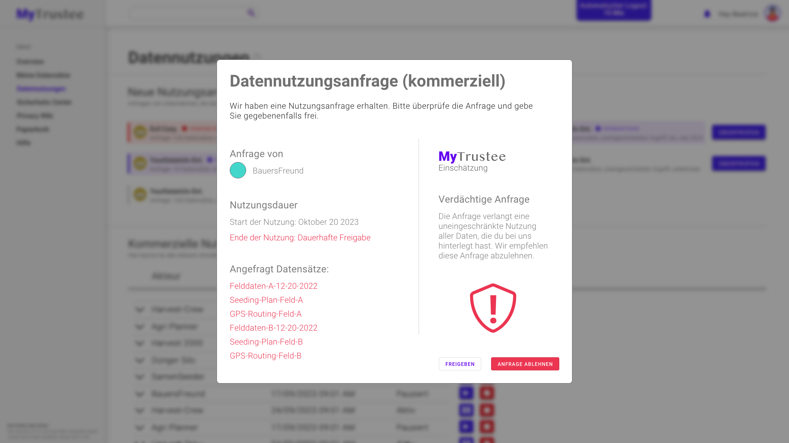

Das Bild  [Vertrauensvolle Nutzungsanfrage](img_17.png)  zeigt eine vertrauensvolle Anfrage von einem durch den DTH zertifizierten Datennutzer. Es werden die gleichen Elemente verwendet, die auch bei einer verdächtigen Anfrage vorkommen. Der Unterschied liegt darin, dass die Elemente der Anfrage nicht als verdächtig markiert sind und der DTH eine positive Zusammenfassung für eine potentielle Freigabe liefert. Auch hier gilt, der Nutzer hat die alleinige Entscheidung über das an- oder abnehmen der Anfrage.

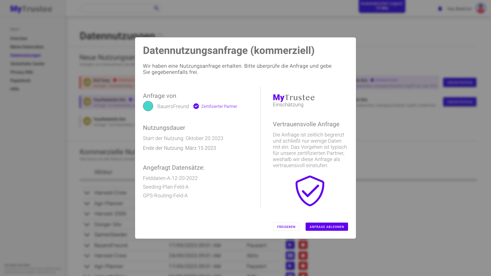

### Übersicht über Datennutzer

Wie bereits im vorherigen Kapitel erwähnt, werden im hier gezeigten Beispiel Nutzungsanfragen und die Übersicht über die Datennutzer auf einer Seite angezeigt (siehe Bild  [Datennutzungsscreen mit Nutzungsanfragen und der Datennutzerübersicht](img_11.png). Je nach Art des DTH können Datennutzer mit verschiedenen Interessen vertreten sein. Ein klassisches Beispiel hierfür ist die Nutzung von Daten von Unternehmen (kommerzielle Gründe) und die Nutzung durch Forschungsinstitute (Nutzung der Daten zur Forschung). Treten solche oder ähnliche Fälle in einem DTH auf, ist es für den Nutzer hilfreich, dass diese klar voneinander getrennt sind. Der Nutzer sollte zu jeder Zeit wissen, welche Anfragen für welchen Zweck sind und hat hierdurch einen besseren Überblick. Die Art und Weise der Darstellungen diese Kategorisierungen von Datennutzern kann unterschiedlich umgesetzt werden. Eine ganzheitliche Tabelle, die über Filter nur die gewünscht Kategorie anzeigt oder nach diesen sortieren lässt ist eine Option. Eine weitere ist der Einsatz von individuellen Tabellen pro Kategorie. Ist die Anzahl an Kategorien schon zu Beginn der Entwicklung bekannt und für den Nutzer überschaubar, ist dies wegen ihrer klarer Trennung von Informationen eine sehr gute Wahl.

Die Abbildung [Ansicht der Datennutzer in zwei Kategorien](img_18.png)  zeigt die Aufteilung der Datennutzer in die beiden Kategorien kommerzielle Nutzung und Forschung. Der blau markierte Bereich des Bildes zeigt Informationen, die nur durch das scrollen auf dem Screen sichtbar werden.

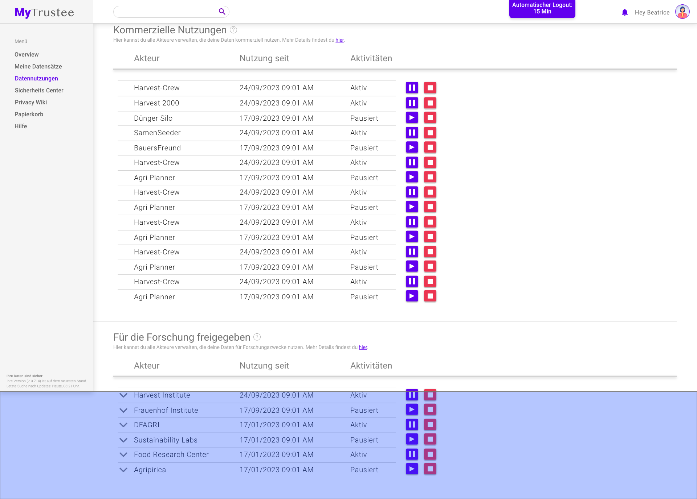

Die Darstellung der Datennutzer in diesen Kategorien selbst soll vor allem klar machen, welcher Datennutzer seit wann eine Nutzungsfreigabe hat. Es ist auch denkbar, dass hierüber alle Datensätze, auf die er Zugriff hat, eingesehen werden können. Der Nutzer sollte an dieser Stelle die Möglichkeit erhalten, Nutzungsfreigaben zu stoppen. Damit diese Anfragen nicht aus versehen gestoppt werden, sollte die Aktion durch einen extra Dialog gestoppt werden (siehe Bild  [Dialog zum Beenden der Nutzungsfreigabe](img_19.png)). Werden Daten kontinuierlich abgerufen, kann es hier für den Nutzer interessant sein, Anfragen zu pausieren oder wieder aufzunehmen.

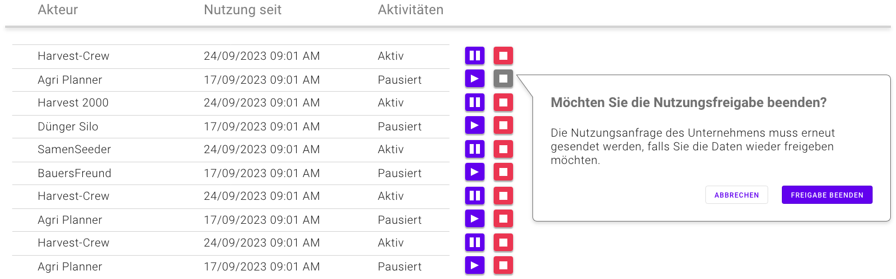

#### **Anmerkungen:**

-   Auf den in diesem Kapitel gezeigten Screens werden Erklärtexte und weitere Informationen (durch das "?" aufrufbar) gezeigt. Diese sollen dem Nutzer dabei helfen zu verstehen, was in den einzelnen Bereichen jeweils passiert. Das Verständnis hierfür ist besonders wichtig, da es im Kontext der DTH-Plattformen und für Nutzer oft kritische, schützenwürdige Daten geht. Ist die Zielgruppe besonders sicher im Umgang mit dieser Art von Software/Technologie können diese Informationen auch ausgelagert werden. Beispielsweise in ein Handbuch.
    -   Dies kann auch positive Effekte auf erfahrene Nutzer haben, da für sie nicht relevante Informationen ausgeblendet werden.
    -   Wichtig ist am Ende nur, dass die Nutzer wissen, wo sie sich über die einzelnen Funktionen informieren können.

## Nachverfolgung von Datenflüssen

### Allgemeiner Aufbau von Datenflüssen

**Dies ist ein Sonderfall unter den Ansichten. Der Gedanke dahinter ist das Aufzeigen von Datenflüssen die den Nutzer betreffen. Dabei kann der Nutzer selbst wählen, ob er die Ansicht basierend auf Datensätzen oder auf den Unternehmen starten möchte, denen er eine Nutzung erlaubt hat.**

Für die Verwaltung von Daten durch einen Datentreuhänder, egal ob wir von einer Verwaltungs-. Auswertungs- oder Zugangs-Treuhand reden, gibt es bei den Nutzern das Bedürfnis zu verstehen, welche Informationen auf welche Art von wem verwendet werden. Das gleiche gilt auch aus der Perspektive von Dritten, hat ein Nutzer lange Nutzungsvereinbarungen mit Dritten, möchte er wissen, welche Unternehmen, welche Daten verwenden und wie sie diese verarbeitet haben bzw. aktuell noch verarbeiten. D.h., auch eventuelle Ergebnisse, die durch die Nutzung von Dritten entstehen, werden hier gelistet.

Eine effiziente Möglichkeit diese Informations- bzw. Datenflüsse darzustellen ist das verwenden von Datenflussdiagrammen oder ähnlichen Darstellungen. Ein Screen, der diese Darstellung übernimmt, muss alle Funktionen, die der DTH dem Nutzer im Bezug auf das Verwalten von Daten gibt, grafisch abbilden können. Zu diesen gehören bspw.:

1.  **Datensatz/-nutzer als Startpunkt auswählen**  
    Beginnt der Nutzer mit einem Datensatz, werden alle Datennutzer angezeigt, die (pausierten) Zugriff auf diesen haben.  
    Bei einem Datennutzer als Startpunkt, werden hingegen alle Datensätze aufgerufen, auf diese er (pausierten) Zugriff hat.
2.  **Mehrere Datensätze/-nutzer gleichzeitig abbilden**
    Der Nutzer kann zusätzlich zum ersten, ausgewählten Datensatz/-Nutzer weitere ergänzen, um einen Überblick über einen größeren Bereich von Datensätzen bzw. -nutzern erhalten zu können.
3.  **Pausierte Datennutzen anzeigen**
    Hat ein Datennutzer gerade keinen Zugriff auf den Datensatz der angezeigt wird, weil der Nutzer/Inhaber des DTH-Accounts diesen vorübergehend pausiert hat, muss er trotzdem angezeigt werden. Eine klare Hervorhebung des Status der Nutzung ("pausiert") ist hilfreich (nur Falls der DTH-Plattform diese Art von Datennutzung unterstützt).
4.  **Anzeigen, seit wann die Datennutzung aktiv ist**
    Werden Datennutzer angezeigt, die eine aktive Nutzungserlaubnis haben, sollte das Startdatum, bzw. der Nutzungszeitraum angezeigt werden (nur Falls der DTH-Plattform diese Art von Datennutzung unterstützt).
5.  **Outputs/Ergebnisse der Datennutzung anzeigen**
    Werden durch die Nutzung der Datensätze neue Outputs (Daten) erstellt sollten diese im Datenfluss auch angezeigt werden.
6.  **Falls für das Erstellen eines Outputs/Ergebnisses mehrere Datensätze benötigt wurden, die noch nicht gelistet wurden, müssen diese    ebenfalls aufgelistet werden**
    Für die Erstellung von Outputs/Ergebnissen werden teilweise mehrere Datensätze benötigt. Wurden die zu Beginn nicht selbst vom Nutzer der Anwendung aufgelistet, muss das System diese Ursprünge automatisch mit aufführen. Diese Datensätze sollten aber klar von denen unterscheidbar sein, die der Nutzer selbst ausgewählt hat.

### Beispiel "Data FlowView"

#### Grundstruktur und Auswahl von Datensatz/-nutzer

In unserem Beispiel heißt der Datenfluss  **"Data FlowView" (DFV)**. Das Konzept dahinter deckt sich mit den oben genannten Funktionen. Um diese Kernfunktionen umzusetzen eignet sich ein 2-spaltiger Ansatz. Dabei wird eine Spalte, die den kleineren Teil des Screens einnimmt, als Auswahlbereich für Datensätze und -nutzer. Die andere, die den Großteil der Fläche nutzt, dient der eigentlichen Darstellung des Datenflusses. Das Bild  [DFV mit ausgewähltem Datensatz](img_20.png)  zeigt die Aufteilung in die beiden Spalten. Bei der Auswahl des Datensatzes oder des Datennutzers sollte das System in dem Sinne unterstützen, dass es dem Nutzer Vorschläge basierend auf dessen Eingabe gibt. Das Bild  [Datensatz wählen](img_21.png)  zeigt dies an einem Beispiel.

Weiterhin wird hier ersichtlich, dass zu jedem Datennutzer angegeben wird, ob die Nutzungsrechte noch aktiv oder bereits beendet sind. Dies ist dann relevant sind, wenn Daten kontinuierlich gestreamt werden (bspw. beim Abrufen von Sensordaten).

Im Bild wird ebenfalls gezeigt, dass für den "Effizienzbericht 2022" zusätzlich zu der ursprünglich gewählten Datei noch weitere Dateien verwendet wurden. Der Knoten oben, der den Inhalt "+4" zeigt dies an. Die ist das gewählte Mittel, um nicht gelistete, aber für den Pfad benötigte, Datensätze anzuzeigen. Dieses Elemente kann bzw. sollte natürlich so weit interaktiv gestaltet werden, als dass der Nutzer nachvollziehen kann, welche Daten sich hinter dem "+4" verstecken. Das kann durch ein Popup gelöst werden, dass per Hover über oder Klick auf das Element geöffnet wird. Wie genau die Interaktion aussehen soll, ist vom Anwendungsfall des DTH abhängig.

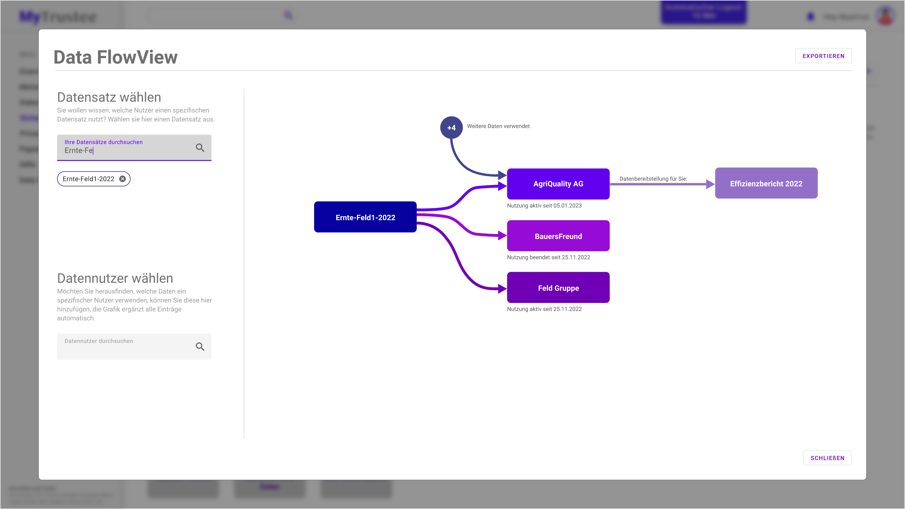 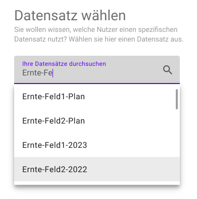

#### Auswahl mehrerer Datensätze/-nutzer

Das Ergänzen von weiteren Datensätzen/-nutzern passiert auf dem gleichen Screen wie das hinzufügen des ersten Datensatzes/-nutzers. Eine klare Unterscheidung ist wichtig, um den Nutzer bei der Unterscheidung von Daten oder Datennutzern zu unterstützen. In diesem Beispiel wird dies über die Verwendung von Farben ermöglicht. Es sind aber auch andere Unterscheidungsmerkmale denkbar. Zu diesen gehören: unterschiedliche Formen, Icons pro Datensatz, unterschiedliche Rahmen, etc.

Das Bild  [DFV mit 2 oder mehreren Datensätzen](img_22.png)  zeigt wie die Auswahl von zwei Datensätzen mit einer farblichen Unterscheidung umgesetzt werden können. Weiterhin wird hier deutlich, dass die ausgewählten Datensätze unterhalb der Eingabe/Suche aufgelistet werden. Dies dient zum einen zur Bestätigung, dass die ausgewählten Datensätze auch wirklich vom System abgerufen werden, es ermöglicht dem Nutzer aber auch, diese schnell zu entfernen, falls sie nicht mehr benötigt werden oder vom Nutzer eine falsche Auswahl vorgenommen wurde.

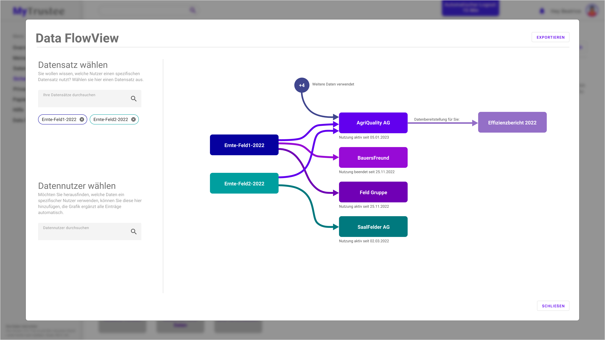

#### Anzeigen von pausierten Nutzungsfreigaben

Pausierte Nutzungen, die wie gesagt nur dann relevant sind, wenn Daten kontinuierlich gestreamt werden, sollten in einem Datenfluss ebenfalls deutlich hervorgehoben werden. Auch hier gibt es, wie bei dem gleichzeitigen Anzeigen mehrerer Datensätze, verschiedene Möglichkeiten der Visualisierung. Im Beispiel wurden die Verbinder zwischen Daten und dem Datennutzer, dessen Zugriffsrechte pausiert sind, durch ein "Pause"-Symbol ergänzt. Das Bild  [DFV mit pausierten Nutzungsrechten](img_23.png)  zeigt den pausierten Zustand eines Datennutzers.

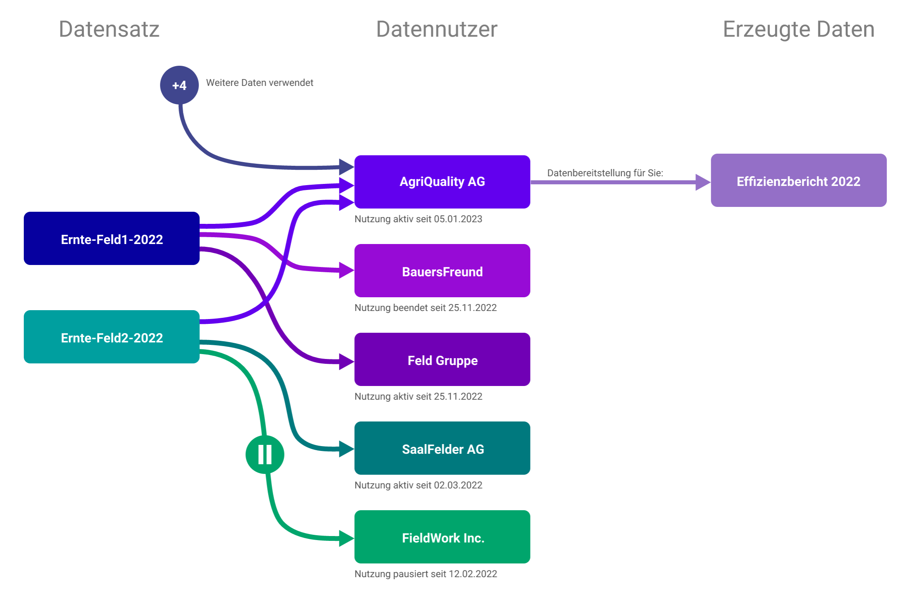

#### Hervorheben/Fokus einzelner Datenflüsse

In der realen Nutzung des DFV kann es zu sehr komplexen Ansichten kommen. Um als Nutzer nachverfolgen zu können, wo welche Daten gerade genutzt werden und was daraus entstanden ist, können Filter helfen. Filter können ähnlich wie in einer Tabelle genutzt werden: Sie befinden sich am Kopf des Screens und ermöglichen diverse Einstellungen, um die gewünschten Daten anzuzeigen (Dazu mehr in "Anmerkungen und Tipps"). Filter können aber auch durch das direkte Interagieren mit den Elementen auf dem Screen aktiviert werden. Diesen Ansatz verfolgt unser DFV Beispiel: In dem ein Datensatz oder Datennutzer angeklickt wird, werden nur noch die Pfade und Elemente hervorgehoben, die mit ihm in Verbindung stehen (siehe Bild  [DFV mit einem hervorgehobenen/ausgewählten Datennutzer.](img_24.png). Alle andern Elemente hingegen werden in den Hintergrund geschoben. Im Beispiel geschieht dies durch das "Ausgrauen" dieser Elemente.

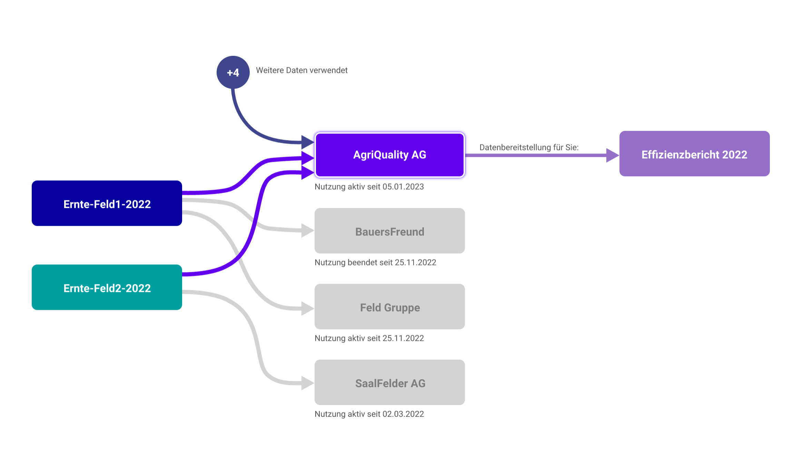

#### **Anmerkungen und Tipps:**

-   Der DFV wurde in diesem Beispiel in einem Modal geöffnet, dass über einen Button wieder geschlossen werden kann. Es wäre genauso denkbar, diese Funktion als "Hauptscreen" anzulegen, um ihn in der Menüstruktur direkt öffnen zu können.  
    
-   Je nach Domäne in der der DTH eingesetzt wird, können weitere Filter, zusätzlich zur Auswahl von Datensätzen/-nutzer sinnvoll sein. Dabei spielt aber auch die Art des DTH eine Rolle. Soll mit ihm bspw. ermöglicht werden, große Mengen an Daten visualisiert zu werden, kann es passieren, dass eine große Menge an Datennutzern im DFV aufgelistet wird. Filter, die dabei unterstützen, in einem bestimmten Zeitraum zu suchen oder die nur eine bestimmte Art von Datennutzern anzeigen können dabei helfen, eine bessere Übersicht zu erhalten.
-   Der DFV in diesem Beispiel ist rein zur Darstellung von Datenflüssen gedacht. Je nach Anwendungsfall kann es auch eine Option sein, direkte Interaktionen mit Datennutzern oder Datensätzen im DFV zu ermöglichen. Dazu gehört bspw. das Löschen oder Hinzufügen von Datensätzen oder das Pausieren/Beenden von Nutzungsfreigaben.

## Weitere Konzepte

### Sicherheitsstatus meiner Daten

Eines der Grundprinzipien von Datentreuhändern ist das sichere Aufbewahren von Daten, die Nutzer bei Ihnen ablegen. Je nach Domäne in der der Datentreuhänder zum Einsatz kommt, können unterschiedliche Sicherheitsbedürfnisse bestehen. Wird mit besonders kritischen Daten gearbeitet ist es für die Nutzer von Bedeutung, direkt erkennen zu können, ob es Datenbrüche gab und ob die eigenen Daten davon betroffen oder noch sicher sind. Zusätzliches vertrauen kann ebenfalls dadurch geschaffen werden, dass diese Informationen als Statistiken über den Nutzungszeitraum gesammelt angezeigt werden. Es ist wichtig durch die Problemanalyse zu identifizieren, ob und in welchem Ausmaß ein solches Feature benötigt wird. Es ist kein "must have", um eine Plattform zu betreiben. An dieser Stelle wird nur ein Beispiel-Screen gezeigt, um ein mögliches Konzept zu verdeutlichen:

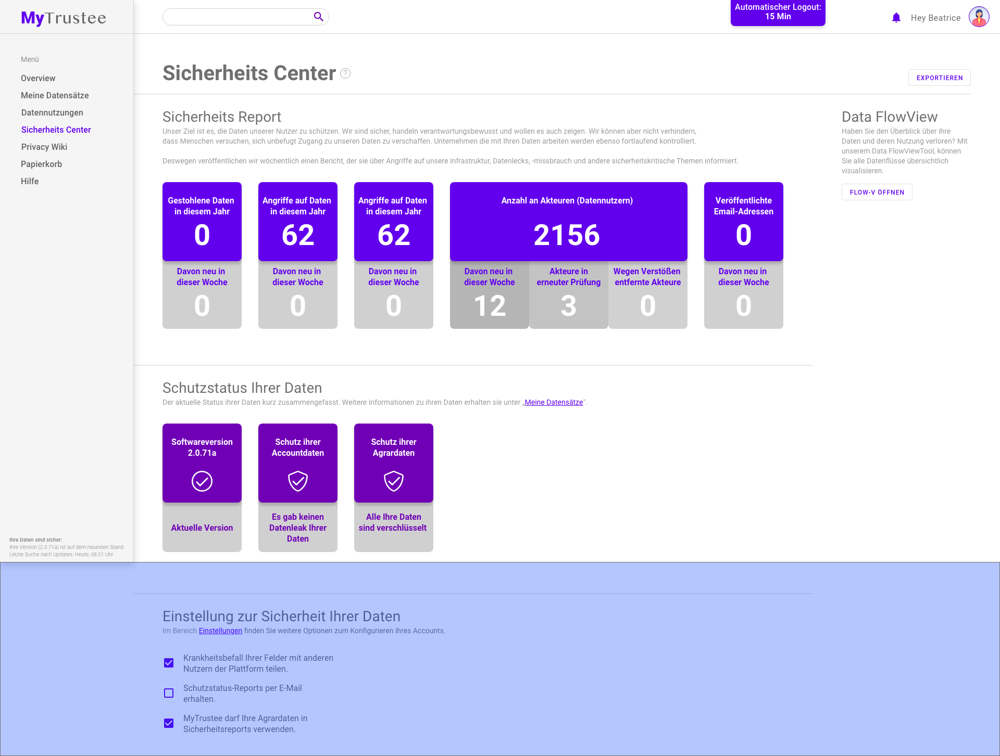

-   Die Abbildung zeigt ein exemplarisches Konzept. Interessant hierbei ist zu erwähnen, dass unser Datenfluss Konzept als eine Art Sicherheitsfeature angedacht war, um erkennen zu können, ob bestimmte Datennutzer Zugriff auf Datensätze haben, die für sie nicht relevant sind.
-   Der blau markierte Bereich des Bildes zeigt Informationen, die nur durch das scrollen auf dem Screen sichtbar werden. In diesem Fall können hier Einstellungen vorgenommen werden, die mit dem Teilen von Informationen zusammenhängt. Diese sind nur beispielhaft platziert worden. So können im Beispiel Feld-/Agrardaten die Informationen über einen Schädlingsbefall beinhalten anonym als Warnung mit anderen Nutzern geteilt werden.

### Kritische Warnungen

Wurde eine verdächtige Aktivität festgestellt, oder ein aktiver Datennutzer vom DTH als unseriös/Bedrohung eingestuft, kann die DTH reagieren, in dem sie während der aktiven Session eines Nutzers eine prägnante Warnmeldung anzeigt. Hier auch ein Beispiel dazu:

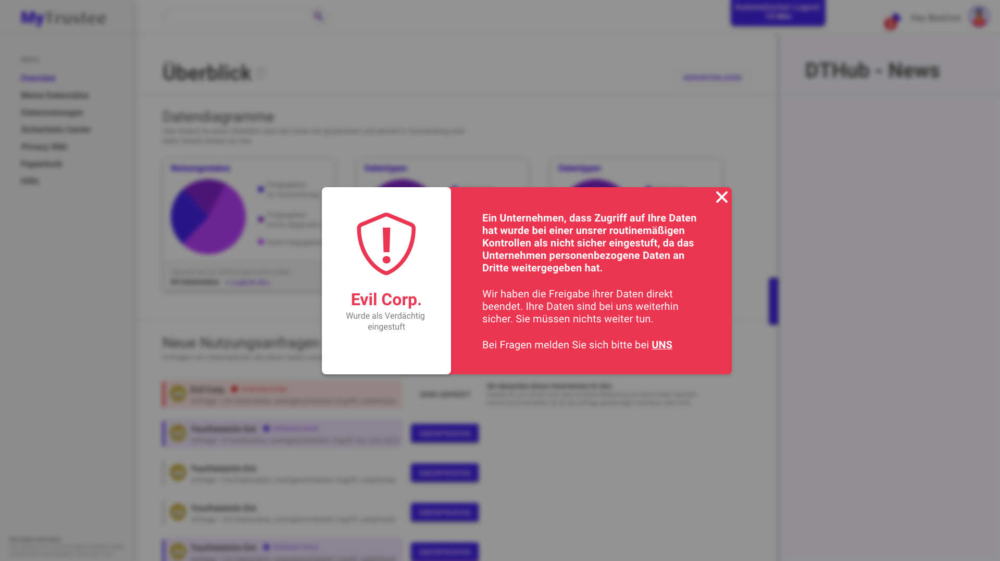

### Domänenspezifische Warnungen zu Krankheitsbefällen

Ein anderes Beispiel in der Gruppe der weiteren Konzepte ist eine Funktion, die spezifisch für den Einsatz von DTH im Agrar- bzw. Landwirtschaftsbereich ist. Das Beispiel zeigt ein Disease Warning System, also eine Überwachungsfunktion, die dem Nutzer mitteilt, ob seine eigenen Felder durch den Befall durch Schädlinge in Gefahr ist. Die Funktion steht nicht im direkten Zusammenhang mit den Kernaufgaben eines DTH. Sie erzeugt aber direkten Mehrwert für den Nutzer, in dem vorhandene Daten benutzt werden, um zu erkennen ob gemeldete Warnungen in der nähe des Nutzers sind. Ist dies der Fall, wird er über das Risiko informiert und ggf. mit Handlungsempfehlungen unterstützt. Im gezeigten Screen wird der Ansatz verfolgt, dass Datennutzer anonym den Befall des eigenen Feldes melden können. Betroffene Nutzer in der Nähe erhalten also keine Informationen darüber, wo die Ursache des Krankheitsbefalls liegt, sondern nur darüber, dass ihr Feld ggf. in Gefahr ist.

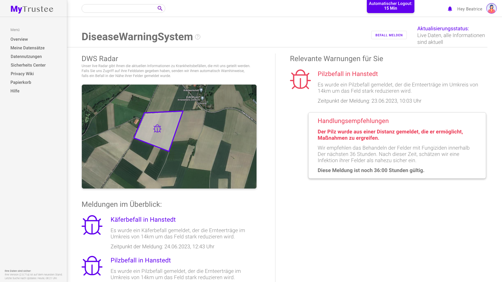

## Schlusswort zu den Design-Konzepten von Datentreuhändern

Die oben genannten Aspekte für einen Datentreuhänder decken die wichtigen Kernfunktionen und wie sie dem Nutzer bereitgestellt werden sollen ab. Sie sollten nicht als allgemeingültige Anleitung zum Erstellen von DTH gesehen werden, sondern als Orientierung, um die Grundkonzept umsetzen zu können. Die Nutzergruppe und die Domäne in der der DTH eingesetzt werden soll entscheiden Maßgeblich über relevante Funktionen und Interaktionskonzepte und sollten daher analysiert und als primäre Anforderungsquelle genutzt werden.