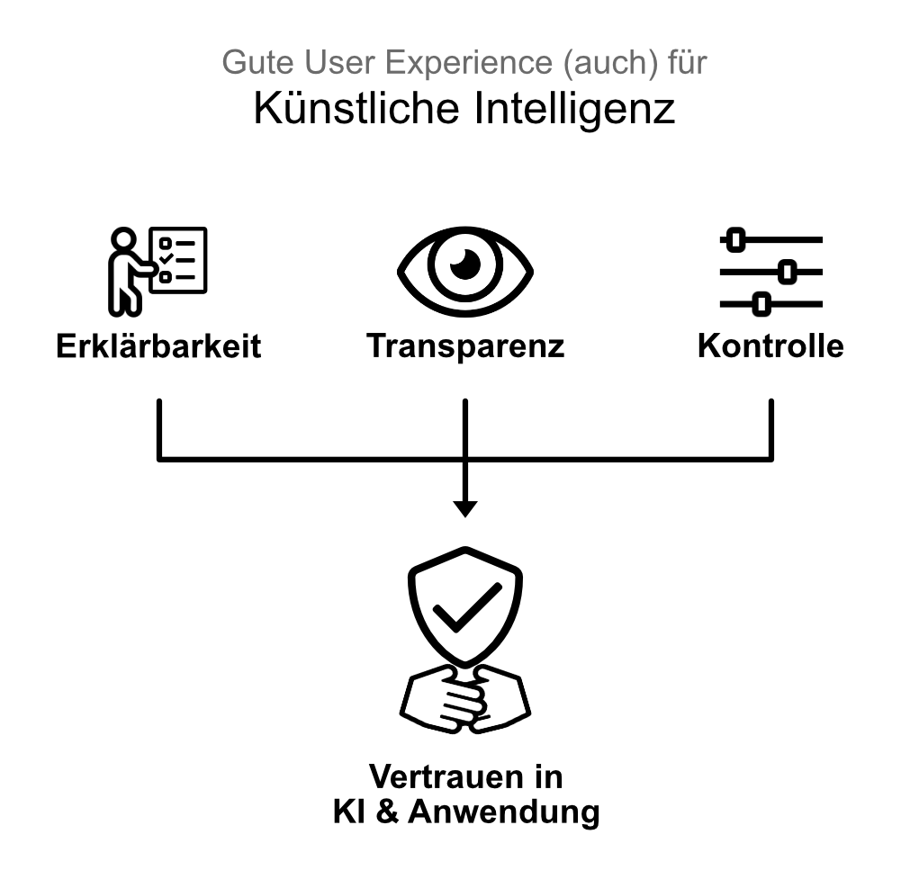
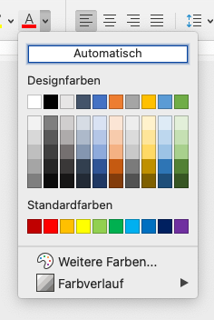
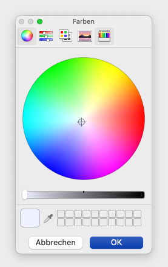

# 2. Design Prinzipien für das Erstellen von DTH-Plattformen

Vertrauen und Sicherheit kann durch die richtige Gestaltung gefördert werden. Hier helfen allgemeingültige, bereits bekannte Regeln und Prinzipien des Interface Designs. Die Prinzipien sollten auf das gesamte Dialogkonzept, also auch die Funktion angewendet werden, die vom DTH bereitgestellt werden. Die relevanten Funktionen gilt es aus den Problemen, die in den frühen Konzeptionsphasen identifiziert wurden abzuleiten. Im Folgenden wird ein Ausschnitt an Design Prinzipien und Heuristiken gelistet und mit dem Fokus auf DTH-Plattformen erklärt.

## Klarheit

Unsere UIs haben das Ziel, den Anwender auf seinem Weg, eine Aufgabe auszuführen, möglichst gut zu unterstützen. Dem Anwender muss klar sein, was zu tun ist bzw. wie er interagieren muss. Im Design wird oft von "Simplicity", der  **Schlichtheit**  von Anwendungen, als wichtigstes Gut gesprochen. Schlichtheit ist wichtig, sie sorgt dafür, dass wir nicht mit zu vielen Informationen überladen werden.

DTH-Plattformen verlangen an dieser Stelle aber mehr als Schlichtheit. Wir müssen nicht nur dafür sorgen, dass wir nicht zu viele Informationen abbilden, sondern auch darauf, dass wir mit  **Genauigkeit**  und  **Klarheit**  Interaktionsprozesse schaffen, die zielführend sind und dabei eine positive UX hinterlassen, die den Anwender überzeugt der Plattform zu vertrauen.

Dies ist bei einem digitalen Produkt wie einem DTH wichtig, da es (ähnlich wie bspw. Banking Apps) einfach zu bedienen sein sollte, die Nutzung spaß machen sollte und dennoch auch einen seriösen Charakter ausstrahlen muss. Eine gute Grundstruktur ist hierfür essentiell, aber auch graphische Elemente (Diagramme, Animationen, etc.) die eingesetzt werden, sollten diesen Charakter ausstahlen.

[Mehr zu Klarheit (externer Link)](https://uxdesign.cc/the-importance-of-clarity-in-ux-91052e0ad4e4)

## Explainability, Transparency, and Control (KI in DTH?)

Künstliche Intelligenz wird immer leistungsfähiger und ist mittlerweile aus vielen Bereichen der Softwarewelt nicht mehr wegzudenken. Sie ist eine Unterstützung für Nutzer, die Ihnen hilft neue Ideen und Lösungswege zu finden, Prozesse effektiver und/oder effizienter zu gestalten oder sie teilweise komplett zu automatisieren.

Auch wenn im UI-Mockups Bereich KI nicht im Beispielkonzept vorgesehen wurde, ist es eine Technologie, die auch früher oder später bei DTH Einzug finden wird. Wie immer gilt, eine Technologie sollte nicht der Technologie wegen eingesetzt werden. Sie sollte dann eingesetzt werden, wenn sie ein konkretes Problem für den Nutzer löst.

Gibt es so einen Fall im geplanten DTH, muss darauf geachtet werden, dass die KI in einem gewissen Rahmen funktioniert. Sie sollte folgende Eigenschaften aufweisen:

-   **Erklärbarkeit**  
    Die KI muss ihre Entscheidungsprozesse klar und verständlich kommunizieren können. Vor allem dann, wenn sie große Auswirkungen auf den Nutzer oder dessen Daten hat.
-   **Transparenz**  
    Um Vertrauen Aufbauen zu können, muss der Nutzer die Prozesse einer KI einsehen bzw. bewerten können. Gewährleistet die KI dies, ist es für den Nutzer außerdem einfacher die Vorteile bzw. Stärken, aber auch die Grenzen der KI zu verstehen.
-   **Kontrolle**  
    Der Nutzer benötigt eine gewisse Kontrolle über das Verhalten der KI, um Vertrauen aufbauen zu können. Es sollte ihm ermöglicht werden, die Einstellungen der KI an seine Bedürfnisse anzupassen.

Eine KI, die diese Eigenschaft hat und dem Nutzer Aufgaben erleichtert oder abnimmt schafft es, seriös zu wirken und Vertrauen nicht nur in die KI sondern auch in den DTH aufzubauen.

**Anmerkungen:**

-   Das Umsetzen dieser drei Eigenschaften hat auch ohne den Einsatz von KI positive Effekte:
    -   Begriffserklärungen schaffen Klarheit. Gerade beim Umgang mit sensiblen Daten möchte der Nutzer ein perfektes Verständnis davon haben, was bei jeder Interaktion passiert.
    -   Auch ein Transparenter Umgang mit Verarbeitungsprozessen wirkt sich positiv auf die Nutzung aus. Nutzer eines DTH fühlen sich sicherer, wenn sie wissen, wie Daten gespeichert werden, wie sich gesichert werden oder wie Datennutzer überprüft werden.

[Mehr zu Explainability, Transparency, und Control (externer Link)](https://bootcamp.uxdesign.cc/empowering-users-how-explainability-transparency-and-control-can-help-designers-create-3802d14700c6)

#### Das mentale Modell erkennen und verstehen

Das Mentale Modell beschreibt, wie der Lösungsweg eines Nutzers aussieht. Beim Gestalten einer Softwareanwendung versuchen Designer das Mentale Modell der Nutzer zu verstehen, und mit dem konzeptionellen Modell der Anwendung möglichst deckend zu entwickeln. Das heißt auch, dass Elemente die im natürlichen Umfeld der Nutzer in die digitale Anwendung übersetzt werden. Ein Beispiel hierfür ist der Papierkorb in Betriebssystemen. Nutzern ist sofort klar, dass Daten gelöscht werden, wenn sie in diesem landen.

Für den DTH stellt sich die Frage, wie ein "physischer" Treuhänder mit dem Nutzer interagiert und ob dieses Bild für den Nutzer auch auf einen digitalen Treuhänder zutrifft. Prozesse die physisch stattfinden, machen evtl. auch im digitalen Sinn. Eine gut geplante Analysephase zu Beginn eines DTH Entwicklungsprojekts kann die entscheidenden Erkenntnisse liefern.

[Mehr zu Mentalen Modellen (externer Link)](https://www.nngroup.com/articles/mental-models/)

#### Visuelle Hierarchie (VH)

Eine der Kerntechniken im Design Prozess einer Softwareanwendung ist die Visual Hierarchy. Seine wurzeln liegen in der Theorie der Gestaltpsychologie. Im Grunde beschreibt die VH die (An-)Ordnung der visuellen Elemente auf einem Screen. Diese Anordnung impliziert eine Wichtigkeit für die visuellen Elemente. Eine gute visuelle Hierarchie leitet den Nutzer unterbewusst durch die Informationen und hilft ihm dabei die wichtigen Elemente schnell zu erkennen.

Eine schlechte visuelle Hierarchie hingegen überfordert den Nutzer. Sie führt zu überladenen Screens in denen der Nutzer quasi orientierungslos ist. Um Dies zu vermeiden werden drei Regeln befolgt:

-   **Farbe und Kontrast**  
    Prinzipiell wirken zu viele Farben und Kontrast-Stufen unruhig. Man sollte einem Farbschema folgen. Dieses kann aber Farben beinhalten die in starkem Kontrast zueinander stehen, um sie bestimmte Elemente mehr hervorzuheben und sie dadurch wichtiger erscheinen zu lassen. Es sollten aber nicht zu viele Kontrastfarben sein.
-   **Gruppierungen (Nähe/Abstände von Elementen)**  
    Abstände zwischen Objekten entscheiden darüber, ob sie als eine Gruppe wahrgenommen werden oder nicht. Unabhängig davon ob sie durch Boxen oder Rahmen markiert werden. Dieses Prinzip der Nähe kann genutzt werden, um dem Inhalt einer Anwendung/Website Struktur zu geben, um dem Nutzer so einen klaren Weg durch die Anwendung zu bieten.
-   **Größenverhältnisse**  
    Große Elemente werden als wichtiger wahrgenommen als kleine. Dies kann beim Erstellen einer Hierarchie sehr nützlich sein. In Regel reicht es aus, wenn drei Größen (klein, mittel, groß) verwendet. Feinere Unterschiede werden als unruhig empfunden. Ein klassisches Beispiel für diese Größenangaben sind Überschriften. Hauptüberschriften sind groß und ziehen die Aufmerksamkeit auf sich. Hat ein Nutzer den Bereich gefunden, der ihn interessiert, kann er von hier aus weiter nach Details suchen. Eine Unterüberschrift (also die mittlere Größe) präzisiert die Suche. Hat der Nutzer den passenden Bereich gefunden, kann er im Textbody (kleine Größe) alle relevanten Informationen finden.

Für eine DTH Plattform ist die VH genauso relevant wie für andere Anwendungen auch. Besonders interessant kann ihr Einsatz werden, wenn sich dazu entschieden wird, dass ein Screen mehrere große Funktionen beinhaltet. Im UI Beispiel ist dies bei der Übersicht der Datennutzer der Fall. Zum einen werden die Nutzer in 2 Kategorien aufgeteilt und zusätzlich werden im oberen Bereich der Seite die neuesten Nutzungsanfragen gelistet. Ohne eine gute VH wäre diese Informationsdichte für die meisten Nutzer zu überfordernd.

[Mehr zur Visuellen Hierarchie (externer Link)](https://www.nngroup.com/articles/visual-hierarchy-ux-definition/)

### Nur die notwendigen Informationen anzeigen

Es klingt logisch, ist aber häufig eine großes Problem in der Umsetzung: Wir sollten Screens nicht mit Funktionen überladen und nur die Funktionen in unsere Anwendung packen, die für den Nutzer einen echten Mehrwert bieten. Es gibt Prinzipien wie Progressive Disclosure und Hick's Law (siehe Unterkapitel), die uns dabei helfen, die wichtigste Grundlage schafft aber eine gute Anforderungsanalyse und das identifizieren des  [Minimal Viable Product (externer Link)](https://www.interaction-design.org/literature/article/minimum-viable-product-mvp-and-design-balancing-risk-to-gain-reward).

#### Progressive Disclosure

Egal welche Art von Software entwickelt benötigt, bzw. entwickelt wird: Eine zu hohe Komplexität überfordert die Menschen und macht das Tool schlecht nutzbar. Das ist vor allem bei neuen Nutzern eine Herausforderung. Dem Gegenüber stehen erfahrene Benutzer, die die Software möglichst effizient verwenden möchten. Progressive Disclosure ist eine Technik, die  **fortgeschrittenere oder auch selten verwendete Funktionen auf weitere Screens verlagert**  bzw. allgemein geschickt versteckt, bis sie benötigt werden.

Ein Beispiel hierfür ist die Auswahl einer Schriftfarbe in Office Produkten:  
Für alle Nutzer ist eine vordefinierte Farbpalette vorhanden. Benötigen Nutzer eine speziellere Farbe, haben sie die Möglichkeit über Untermenüs, ihre Farbe individuell und sehr präzise auszuwählen. Das Bild  [Standardfarbpalette in MS Word](img_2.png)  zeigt die einfache Farbauswahl. Öffnet man den Bereich "weitere Farben", gelangt man zu einem Farbrad, mit dem sehr präzise die gewünschte Farbe ausgewählt werden kann (siehe Bild  [Erweiterte Farbpalette](img_3.png)).

Beim Entwickeln eines Datentreuhänders ist es wichtig zu verstehen, welche Funktionen angeboten werden sollen und wie relevant diese für die Nutzer sind. Gerade bei Funktionen die außerhalb der klassischen Verwaltung von Daten liegen, die aber starke Vorteile für die Nutzer mit sich bringen, muss der  **Faktor Komplexität**  berücksichtigt werden. Ist ein neuer Nutzer überfordert, wird es ihm schwer fallen, sich für das Produkt zu entscheiden. Erfahrene Nutzer hingegen benötigen einen möglichst effizienten Weg, ihre bevorzugten Funktionen zu verwenden. Hier können beispielsweise Shortcuts oder die individuelle Positionierung von Funktionen im User Interface hilfreich sein. Am Ende ist es das Ziel,  **Komplexität zu minimieren**.

#### Hick’s Law

Eine zu hohe Auswahl an Funktionen und Einstellungsmöglichkeiten sind für alle Produkte kontraproduktiv.  **Je mehr Auswahl der Nutzer hat, desto länger benötigt er, um eine Entscheidung zu treffen**. Dies ist vor allem kritisch bei Services, die Kunden Produkte verkaufen wollen. Aber auch in Anwendungen, für die sich ein Nutzer bewusst entschieden hat, wie bspw. einen DTH, kann ein Übermaß an Funktionsumfang negative Effekte mit sich bringen. Der Nutzer ist in diesem Fall genauso überfordert, da er aber vermutlich nicht einfach so auf die nächste Plattform wechseln kann, wird er vor allem frustriert sein.

Es gilt zu vermeiden, dass ein Nutzer in eine solche Situation kommt. Das Anwenden von Progressive Disclosure trägt sicherlich dazu bei, diesem Effekt vorzubeugen, dennoch muss bewusst die Entscheidung getroffen werden, welche Informationen und Funktionen zum Lösen des Problems des Nutzers wirklich relevant sind und welche nur minimale Vorteile bringen. Sind es zu viele Funktionen, die nur minimale Mehrwerte bringen, sollten einige davon entfernt werden.

[Mehr zu Hick's Law (externer Link)](https://www.interaction-design.org/literature/article/hick-s-law-making-the-choice-easier-for-users)